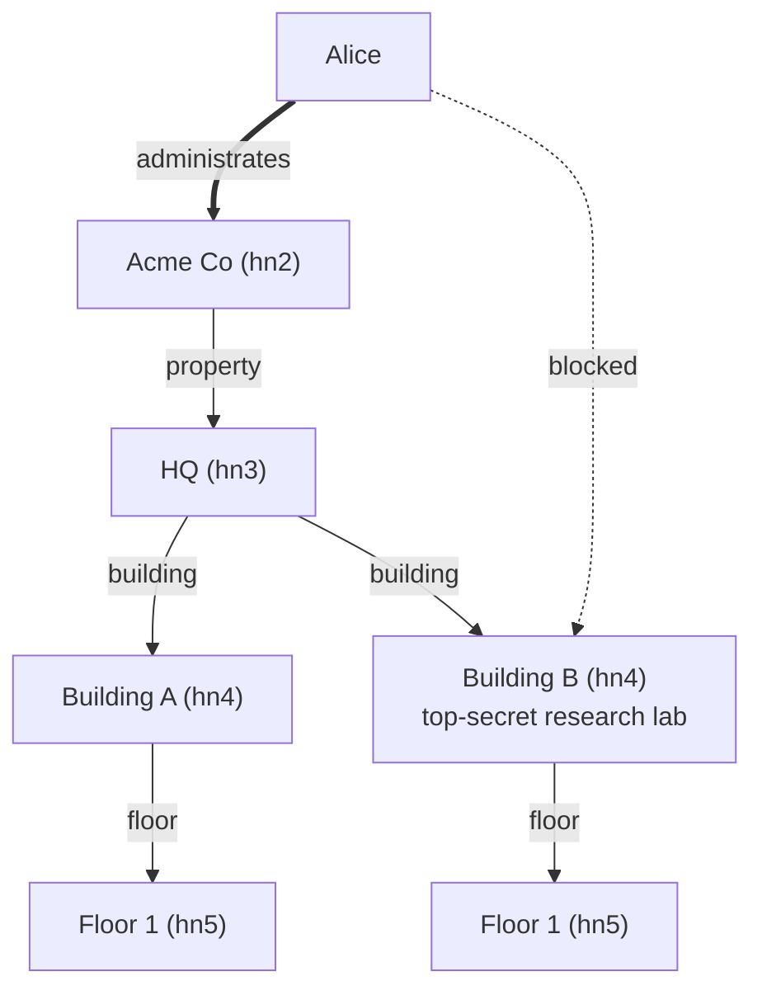

# Architecture

Living reference for the onion layout, the effect surface, error model, and
validation flows. Kept in sync with `lib/`.

For the domain model itself see `docs/hierarchy-and-sensors.md`; for the HTTP
surface see `docs/api.md`.

## 1. Shape

Onion, four layers plus a thin composition root. The core principle:

- **Domain types and rules** live at the center, ignorant of persistence,
  HTTP, and AWS.
- **Business logic** is pure — it expresses effects via OCaml 5 algebraic
  effects, not by calling a repository directly.
- **Repositories are effect handlers**, not modules called from logic. The
  first concrete handler targets DynamoDB via `smaws-clients`; a second
  in-memory handler backs unit tests.
- **The binary** (the Lambda) wires the chosen handler around the logic call
  and exposes a CQRS HTTP surface via API Gateway v2.

## 2. Module layout

```
lib/
  domain/                    # pure types — no effects, no IO
    level.ml                 # Hn0..Hn9 + depth
    node_id.ml               # HN<n>#<int>  (root = literal HN0#root)
    node.ml                  # node record
    schema.ml                # edges + metadata + sensors + validate
    metadata.ml              # field_type, field_spec, value validator
    sensor_id.ml             # S#<int>
    sensor_sk.ml             # active#<ts> / <ts> sort-key codec
    sensor.ml                # sensor record + meter_type
    formula.ml               # AST + eval + referenced_ids (Sensor_id, not uuid)
    edge_kind.ml             # Has_label | Has_sensor | Blocked | Administrates + sk/gsi verbs
    user_id.ml               # U#<email>
    user.ml                  # user record
    cognito_group.ml         # Reader | Writer | Admin (capability ceiling)
    language.ml              # danish | swedish | norwegian | english | german
    currency.ml              # DKK | SEK | NOK | USD | EUR
    errors.ml                # error sum type + http_status + message/details

  effects.ml                 # flat effect declarations + perform wrappers

  logic/                     # pure functions that perform effects
    hierarchy.ml             # add_node, list_children, list_child_refs,
                             #   delete_node, level resolution
    schema_check.ml          # find_for — walk up to hn2
    sensors.ml               # attach, list_active, replace_device,
                             #   set_formula, evaluate
    users.ml                 # create, get, update, delete, list
    access.ml                # block, unblock, effective_permission,
                             #   list_blocked_nodes, list_blocked_users,
                             #   grant_administrates, list_administrated_nodes,
                             #   has_admin_access

  repo/                      # effect handlers
    memory.ml                # in-memory handler (tests)
    dynamo.ml                # smaws-clients / Eio handler
    codec.ml                 # node/edge/sensor <-> DynamoDB item maps

  api/                       # CQRS dispatch + JSON / HTML rendering
    api_command.ml           # POST /command dispatcher
    api_query.ml             # GET  /query/<action> dispatcher (JSON)
    api_json.ml              # API Gateway v2 envelope + error formatting
    api_html.ml              # GET /hierarchy/query/* HTMX HTML fragments
                             #   (pure-html eDSL; Hx.* attrs, auto-escaping)

  handler.ml                 # HTTP routing: method+path -> command/query/html;
                             #   form-urlencoded + base64 body decoding

bin/
  main.ml                    # Lambda_runtime.start; Eio env + smaws client;
                             #   Repo.Dynamo.run wraps Handler dispatch

test/                        # pure + memory-handler tests (alcotest)
itest/                       # real-table integration tests
```

### Dependency rule

| Layer     | May depend on                      |
|-----------|------------------------------------|
| `domain`  | stdlib, `ptime`, `yojson`          |
| `effects` | `domain`                           |
| `logic`   | `domain`, `effects`                |
| `repo`    | `domain`, `effects`, `smaws-*`     |
| `api`     | `domain`, `effects`, `logic`       |
| `bin`     | everything (composition only)      |

`logic` never imports `repo`. `api` never imports `repo`. The chosen handler
is visible only in `bin/main.ml`.

### File granularity

One type per file in `domain/`. The OCaml `file = module` convention keeps
`Node.t`, `Node.make`, etc. in one module without boilerplate, and the
file-level dependency DAG makes layer rules visible at a glance.

## 3. Effect surface (flat)

All effects are top-level constructors of `_ Effect.t` in a single module.

```ocaml
(* lib/effects.ml *)
type _ Effect.t +=
  (* reads *)
  | Get_node       : Node_id.t -> Node.t option Effect.t
  | List_children  : Node_id.t * Edge_kind.t option -> Node.t list Effect.t
  | List_child_refs: Node_id.t * Edge_kind.t option ->
                       (Node_id.t * string) list Effect.t
  | Get_schema     : Node_id.t -> Schema.t option Effect.t

  (* atomic add: allocate the next int id at [level] and write
     node + parent edge + counter bump in one TransactWriteItems *)
  | Add_node       : { level : Level.t;
                       build : id:int -> Node.t * edge_spec }
                       -> (Node.t, Errors.t) result Effect.t

  | Put_node       : Node.t -> unit Effect.t   (* root + tests only *)
  | Delete_node    : Node_id.t -> unit Effect.t
  | Now            : unit -> Ptime.t Effect.t

(* sensor effects *)
type _ Effect.t +=
  (* atomic add: allocate the next sensor int id and write the active row
     + has_sensor edge + counter bump in one TransactWriteItems *)
  | Add_sensor            : { build : id:int -> Sensor.t * edge_spec }
                              -> (Sensor.t, Errors.t) result Effect.t
  | Get_active_sensor     : Sensor_id.t -> Sensor.t option Effect.t
  | List_sensor_ids       : Node_id.t -> Sensor_id.t list Effect.t
  | Replace_sensor_device : { old_created : Ptime.t; new_sensor : Sensor.t }
                              -> unit Effect.t
  | Delete_sensor         : { sensor_id : Sensor_id.t; parent : Node_id.t }
                              -> unit Effect.t
  | Get_sensor_reading    : Sensor_id.t -> float option Effect.t

(* user effects *)
type _ Effect.t +=
  | Put_user    : User.t -> unit Effect.t
  | Get_user    : User_id.t -> User.t option Effect.t
  | List_users  : unit -> User.t list Effect.t
  | Delete_user : User_id.t -> unit Effect.t

(* edge / permission effects *)
type _ Effect.t +=
  | Put_edge                 : edge_spec -> unit Effect.t
  | List_blocked_nodes       : User_id.t -> Node_id.t list Effect.t
  | List_blocked_users       : Node_id.t -> User_id.t list Effect.t
  | List_administrated_nodes : User_id.t -> Node_id.t list Effect.t
  | Delete_edge              : { from_ : string; to_ : string; kind : Edge_kind.t }
                                -> unit Effect.t
```

`edge_spec` is a record (`{ from_; to_; kind; name; created; self_path }`)
carried by both `Add_node`/`Add_sensor` (the edge written alongside the new
vertex) and the standalone `Put_edge`. The edge `name` is denormalized onto
the row so `list_child_refs` returns `(id, name)` from a single `Query` without
N round-trips. `kind : Edge_kind.t` (not a free-form string) supplies both the
forward `sk` verb and the inverse GSI1 verb — see `lib/domain/edge_kind.ml`.

There is **no** `Gen_uuid` effect: ids are integers allocated by a monotonic
`count#…` counter row bumped inside the same transaction as the vertex
(`Add_node` / `Add_sensor`). `Put_node` is reserved for the root and tests.

`Add_sensor` atomically writes both the active sensor row and the parent's
`has_sensor` edge row — see `docs/hierarchy-and-sensors.md` §5.3.

`Replace_sensor_device` atomically deletes the old `active#…` row, re-puts it
under a plain timestamp (history), and puts the new `active#…` row — see §5.4.

### Caveat — effects are not in types

OCaml 5 effects are **not tracked in types**. A function that performs an
effect looks identical to a pure one; unhandled effects raise
`Effect.Unhandled` at runtime. Layer purity is a matter of convention (logic
never imports repo) plus tests, not a compiler proof. A deliberate trade-off
for the single top-level handler wiring.

## 4. Storage model

Single DynamoDB table, five item shapes distinguished by the `type` attribute
(and `sk` shape) — `node`, `edge`, `sensor`, `user`, `counter`. `GSI1` inverts
edges so "who points at Y" is one query for any edge kind (hierarchy, sensor,
or block). `counter` rows (`pk = count#HN<n>` / `count#S`, `sk = count`) hold
the monotonic `n` allocator and `live` cardinality per level.

```
Table: hierarchy_new  (or $ITEST_DYNAMO_TABLE)
  PK:  pk (S)
  SK:  sk (S)
  GSI1:
    gsi1pk (S)
    gsi1sk (S)
```

Vertex, edge, and sensor row shapes are documented in
`docs/hierarchy-and-sensors.md` §6. Key distinctions from the original spec:

- Edges carry the child **name** (for lazy listing).
- Sensor rows live in their own `S#<int>` partition; there is no generic
  vertex row for a sensor.
- `Level` is derived from `pk` and not stored as a separate attribute.
- node/user rows use `sk == pk` (no literal `"node"`/`"user"` sort key); a
  sensor's history row uses a bare RFC3339 `sk`, only the active row carries
  the `active#` prefix.

## 5. Validation flow for `add_node`

Input: `{ parent_id; level?; label?; name; metadata; schema? }`.

1. `perform Get_node parent_id`. If `None` → `Not_found parent_id`.
2. **Resolve the child level** (`Hierarchy.resolve_child_level`):
   - `hn0 →` forces `hn1`; `hn1 →` forces `hn2`.
   - Otherwise, load the hn2's schema via `Schema_check.find_for`:
     - `label` given → unique target level whose edge list contains that
       label; error if 0 or >1.
     - no `label` → parent+1 as default.
   - An explicit `level` in the request skips resolution.
3. Check `parent.level.depth < level.depth`.
4. `hn0→hn1` and `hn1→hn2` are handled inline (partner / company). For
   schema-gated levels, `add_under_schema`:
   a. `Schema.edges_between schema parent_level level` → candidate edge
      specs.
   b. Pick the one matching `label`; or the sole candidate if no label; else
      ambiguity error.
   c. `Metadata.validate ~specs metadata` — per-field type, required, and
      constraint checks. All failures collected, not just the first.
   d. `list_children` (filtered by `has_<label>#`) to count existing. Enforce
      `max` cardinality.
5. `perform Now` → created.
6. `perform Add_node { level; build }`. The handler allocates the next int id
   from the `count#HN<n>` counter and writes the node row, the parent
   `has_<label>` edge row, and the counter bump in a single
   `TransactWriteItems` (conditional on the counter, so concurrent adds retry
   rather than collide). `build ~id` constructs the `Node.t` + `edge_spec`.
7. Return the new node.

## 5.1 Walking a request — `create_user`

Shorter than `add_node`, and useful for seeing every layer in one trip:

```
POST /command   { "action": "create_user", "email": "alice@…", … }
        │
        ▼
bin/main.ml                       parses the HTTP envelope, routes by method
        │
        ▼
lib/api/api_command.ml            decodes JSON → typed args, dispatches
        │                         on "action"; calls Users.create
        ▼
lib/logic/users.ml                pure logic, performs effects:
  perform Get_user uid              → None expected; else Conflict
  perform Now                       → Ptime.t for `created`
  perform Put_user user             → write row
        │
        ▼
lib/effects.ml                    declares the effects as types — no impl
        │
        ▼
lib/repo/dynamo.ml                handler match on the effect constructor;
  codec.ml user_to_item               encodes to a DynamoDB item map;
  smaws PutItem                       issues the request;
  failures → Errors.t                 never raises into logic
```

The logic function is ignorant of DynamoDB; the handler is ignorant of
HTTP. Swapping `dynamo.ml` for `memory.ml` in the binary's handler stack
is the whole of the test seam.

## 6. API surface (CQRS)

Two routes, dispatch via sum-type match. See `docs/api.md` for request and
response examples.

### Commands

```
POST /command
{ "action": "add_node",              … }
{ "action": "delete_node",           … }
{ "action": "attach_sensor",         … }
{ "action": "replace_sensor_device", … }
{ "action": "create_user",           … }
{ "action": "update_user",           … }
{ "action": "delete_user",           … }
{ "action": "block_user",            … }
{ "action": "unblock_user",          … }
{ "action": "grant_administrates",   … }
```

### Queries

```
GET /query/get_node?id=…
GET /query/list_children?parent=…[&label=…][&full=true]
GET /query/list_sensors?parent=…
GET /query/get_sensor?id=…
GET /query/get_user?id=…
GET /query/list_users
GET /query/list_blocked_nodes?user=…
GET /query/list_blocked_users?node=…
GET /query/effective_permission?user=…&node=…
```

Adding an action is "add a variant + a case" in `api_command.ml` or
`api_query.ml`.

## 7. Error model

Logic returns `('a, Errors.t) result`. Effect handlers convert smaws failures
to results before returning; they never raise into logic.

```ocaml
(* lib/domain/errors.ml *)
type t =
  | Not_found      of Node_id.t
  | Not_found_user of User_id.t
  | Bad_request    of string
  | Validation     of Metadata.error list
  | Schema_missing of Node_id.t
  | Conflict       of string
  | Internal       of string
```

`Not_found_user` maps to the same `not_found` / `404` row as `Not_found`.

Mapping at the API boundary:

| Error code          | HTTP | Example                                             |
|---------------------|------|-----------------------------------------------------|
| `bad_request`       | 400  | malformed JSON, missing field, invalid level string |
| `not_found`         | 404  | parent/node/sensor not found                        |
| `validation_failed` | 422  | schema rejects metadata, cardinality breach, cycle  |
| `schema_missing`    | 409  | walk to hn2 found no schema                         |
| `conflict`          | 409  | optimistic lock collision                           |
| `internal`          | 500  | anything else, including bubbled smaws errors       |

Response body:

```json
{ "error": { "code": "validation_failed", "message": "…", "details": { … } } }
```

`details` is populated for `Validation` only — the list of `{path, message}`
failures.

## 8. Users and permissions

### User record

```ocaml
(* lib/domain/user.ml *)
type t = {
  id            : User_id.t;
  name          : string;
  cognito_group : Cognito_group.t;
  language      : Language.t;
  currency      : Currency.t;
  created       : Ptime.t;
}
```

`User_id.t` is `U#<email>`; the integer id scheme used for nodes and sensors
does not apply here — the email itself is the logical identity.

### Capability ceiling — upstream enforcement

`Cognito_group.t = Reader | Writer | Admin`. These are **overarching
buckets** — a capability ceiling, not a per-node enforcement mechanism.
`admin > writer > reader` by `Cognito_group.rank`. Upstream (the frontend and
the API Gateway Cognito authorizer) decides what the caller may do; this
Lambda stores the group and reports it back via `effective_permission`.

### Permission edges

Two edge families point from a user row into the hierarchy, both sharing the
single-table shape and differing only in the verb embedded in `sk` / `gsi1sk`:

**Administrates (grant) edges — live.** Written by the `grant_administrates`
command (`Access.grant_administrates`), read by `Access.list_administrated_nodes`:

| Attribute | Value                                              |
|-----------|----------------------------------------------------|
| `pk`      | `U#<email>`                                        |
| `sk`      | `administrates#<node_id>`  (`sk_verb Administrates`)|
| `gsi1pk`  | `<node_id>`                                        |
| `gsi1sk`  | `administrators#<user_id>` (`gsi_verb Administrates`)|

**Block edges — live.** Written by `block_user`, removed by `unblock_user`:

| Attribute | Value                                              |
|-----------|----------------------------------------------------|
| `pk`      | `U#<email>`                                        |
| `sk`      | `blocked#<node_id>`        (`sk_verb Blocked`)      |
| `gsi1pk`  | `<node_id>`                                        |
| `gsi1sk`  | `blocks#<user_id>`         (`gsi_verb Blocked`)     |

`Edge_kind.t = Has_label of string | Has_sensor | Blocked | Administrates`.
There is no `Writes`/`Reads` edge kind — `Cognito_group` is the only
writer/reader distinction and it lives on the user row, not on edges.

### Two evaluation paths

Grants and blocks are consumed by **two separate** mechanisms today:

1. **Visibility (UI), grant-driven** — `Access.has_admin_access ~user_id
   ~node_id` is true iff the user has an `Administrates` edge to `node_id`
   or any ancestor (including `HN0#root`). `api_html.render_nodes` returns an
   empty body when the caller has no user param or no grant on the requested
   parent/ancestors, so a no-grant user sees an empty tree. The seeded admin
   has an `Administrates` grant on `HN0#root`, which makes the whole tree
   visible.
2. **Block checks, block-driven** — `Access.effective_permission` walks the
   node + ancestors (read once from the stored path) and returns `Ok None`
   if any is blocked, else `Ok (Some cognito_group)`. It does **not** consult
   `Administrates` grants — the capability it returns on an allowed node is
   the user's global `cognito_group`.

#### Worked example — visibility grant with a block carve-out

Alice has an `Administrates` grant on Acme Co (a per-node grant on the company
node). `has_admin_access` therefore returns true for Acme Co and every
descendant, so the whole subtree renders for her. A `Blocked` edge on Building
B carves that one subtree out of `effective_permission` without disturbing the
rest.



The thick `administrates` edge (`pk=U#alice@acme.test,
sk=administrates#HN2#<acme-int-id>`) grants visibility; the dashed `blocked`
edge on Building B shadows it for block checks. `effective_permission` walks
from the target up the stored path; the first matching block wins:

| Target node              | Ancestors walked          | `effective_permission`                        |
|--------------------------|---------------------------|-----------------------------------------------|
| `Acme Co`                | —                         | `{"capability": "<alice's group>"}`           |
| `Building A`             | HQ, Acme Co               | `{"capability": "<alice's group>"}`           |
| `Building B`             | HQ, Acme Co               | `{"capability": null, "reason": "blocked"}`   |
| `Floor 1` (under B)      | Building B, HQ, Acme Co   | `{"capability": null, "reason": "blocked"}`   |

The floor inherits the block from its ancestor. One `unblock_user` on Building
B restores the subtree atomically.

**Status.** Both `Administrates` (visibility) and `Blocked` are live. What is
*not* built: folding grants into `effective_permission` so the returned
capability reflects a per-node role rather than the user's global
`cognito_group`. That remains a drop-in behind the single function below.

### `Access.effective_permission` — the delegation point

```ocaml
Access.effective_permission ~user_id ~node_id :
  (Cognito_group.t option, Errors.t) result
```

- `Ok (Some g)` — user exists, no block on `node_id` or any ancestor; `g` is
  the user's `cognito_group` (capability ceiling, not authorization).
- `Ok None` — user exists but the node or an ancestor is blocked.
- `Error (Not_found_user _)` — user does not exist.

This is the **single delegation point** for the entire permission model. Swap
its body for Amazon Verified Permissions / Cedar later without touching the
rest of the codebase.

### Cascade

- Deleting a user removes all that user's `Blocked` edges (`Users.delete`
  enumerates via `List_blocked_nodes`, then `Delete_edge` per row).
- Deleting a node removes all inbound `Blocked` edges (`Hierarchy.delete_node`
  enumerates via `List_blocked_users`).

Both are logic-layer iteration, not a single `TransactWriteItems`.
Non-transactional today.

## 9. Testing

### Unit tests — `test/`, offline, run by `dune runtest`

- **`test_domain_*`** — pure: `Schema.validate`, `Metadata.validate`,
  `Node_id`/`Sensor_id` round-trip, formula eval, sort-key codec.
- **`test_logic_*`** — logic under `Repo.Memory`. Covers the add_node
  happy paths (including level inference), disallowed edges, metadata
  failures, cardinality, sensor attach/list/replace/set_formula/evaluate.
- **`test_api_*`** — JSON in, JSON out, through `api_command` / `api_query`
  wired against `Repo.Memory`.
- **`test_repo_codec`** — `Codec` round-trips against fixture items. Verifies
  the schema-map, sensor `sk` prefix (`active#` vs plain), node attributes.

### Integration tests — `itest/`, `dune build @itest`

- Separate binary and alias so `dune runtest` stays fast and offline.
- Requires `AWS_REGION` and `ITEST_DYNAMO_TABLE`; AWS creds via the standard
  provider chain.
- Covers: `add_node → get_node` round-trip with metadata and schema fidelity;
  `list_children` with and without label filter; cascade delete leaves no
  edges (verified via `gsi1pk`); `TransactWriteItems` atomicity for both node
  and sensor writes; end-to-end sensor attach/list/replace.

## 10. Non-goals

- In-Lambda enforcement of permissions. Upstream (frontend + API Gateway
  authorizer) decides; this Lambda is store-and-report only.
- Amazon Verified Permissions / Cedar integration — kept as a future drop-in
  behind `Access.effective_permission` (see §8).
- Optimistic schema versioning via `ConditionExpression`. No
  `update_schema` command today.
- Caching schema per-company in warm Lambda containers.
- A GSI that indexes by level globally. All traversals start from a known
  parent id.
- Actual time-series backend behind `Get_sensor_reading` — the effect exists;
  handlers return `None` until a reading source is wired in.

## 11. Deploy

- `make build` — Docker-driven static **x86_64** musl build (Alpine, `-static
  -no-pie`; PROVIDED_AL2023), output `ocaml-lambda-hierarchy.zip`.
- `make build-local` — host-arch development build.
- Deploy: normally `cd infra/hierarchy && cdk deploy` (CDK owns the function,
  API Gateway, DynamoDB stream + cross-account bridge). For a code-only push:
  `aws lambda update-function-code --function-name ocaml-lambda-hierarchy --zip-file fileb://ocaml-lambda-hierarchy.zip --region eu-central-1`.

The production HTTP API Gateway (`doztw28ic6`) routes `POST /command`,
`GET /query/{action}`, and `/hierarchy/{proxy+}` to the Lambda running this
binary.
