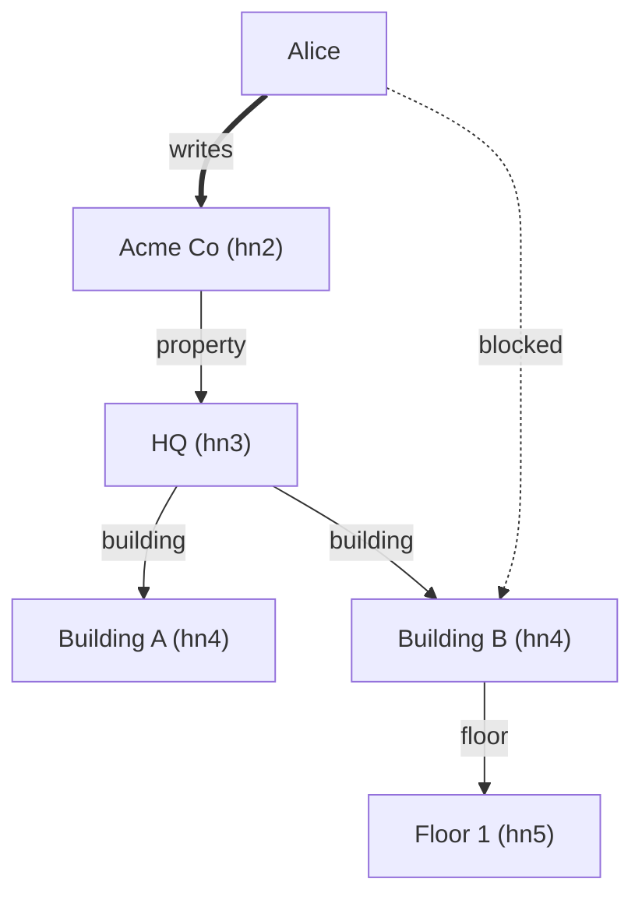

# Architecture

Living reference for the onion layout, the repository-injection pattern, the
error model, and the validation flows. Kept in sync with `crates/`.

For the domain model itself see `docs/hierarchy-and-sensors.md`; for the HTTP
surface see `docs/api.md`.

> The service was ported from OCaml to Rust in 2026-06. The CDK stack names still
> carry the `Ocaml…` prefix (kept so the `RETAIN` DynamoDB table isn't replaced),
> but the code, the schema model, and the permission model below are all current.

## 1. Shape

Onion, with a pure core and a thin composition root. The core principle:

- **Domain types and rules** live at the center (`crates/model/src/domain`),
  ignorant of persistence, HTTP, and AWS.
- **Business logic is pure** (`crates/model/src/logic`) — it expresses its
  storage needs as **injected `async` closures**, not by calling a repository
  directly. There are **no repository traits**: every logic function is generic
  over `Fn`/`FnOnce` closures returning `Future`s.
- **Repository adapters** (`crates/model/src/repository`) provide the concrete
  closures: a DynamoDB backend (`dynamodb`), a Cognito backend (`cognito`), and
  an in-memory `Store` (`memory`, test-only) used by the unit tests.
- **The binary** (`crates/services/hierarchy`) wires the chosen closures around
  the logic call and exposes a CQRS HTTP surface (Lambda HTTP / API Gateway v2).

### Why closures instead of traits

A trait-based repository would force every logic function to name a `Repo`
type parameter and thread an associated-type soup of futures. Injecting one
closure per operation keeps each logic function's dependencies explicit in its
signature (you can see at a glance that `add_node` needs exactly `get_node`,
`list_children`, and `add_node`), and lets a test wire three lines of in-memory
closures without implementing a trait surface. The closures are `Fn` when the
logic may call them more than once (e.g. `get_node` during a schema walk) and
`FnOnce` otherwise.

## 2. Crate & module layout

```
crates/
  model/                       # pure domain + logic + repository adapters
    src/
      domain/                  # pure types — no IO
        ids.rs                 # Level (Hn0..Hn9 + depth), NodeId, SensorId, UserId
        node.rs                # Node record + make / path helpers
        schema.rs              # type-graph Schema (v2) + metadata validation
        values.rs              # EdgeKind, CognitoGroup, Profile, FieldType,
                               #   MeterType, Language, Currency, Timezone, …
        sensor.rs              # Sensor record + MeterType
        sensor_sk.rs           # active#<ts> / <ts> sort-key codec
        formula.rs             # formula AST + eval + referenced ids
        user.rs                # User record
      logic/                   # pure functions; repo ops injected as closures
        hierarchy.rs           # add_node, list_children, list_child_refs, get_node
        schema_check.rs        # find_for — walk up to the HN2 schema
        sensors.rs             # attach, list_active, replace_device, set_formula, evaluate
        users.rs               # create, get, update, delete, list
        access.rs              # block/unblock, grant_access/grant_administrates,
                               #   effective_permission, has_access/has_admin_access,
                               #   start_nodes, blocked/administrated-list queries
      repository/              # concrete closure providers
        dynamodb/              # node, edge, sensor, user, codec — AWS SDK calls
        cognito/               # user provisioning / deletion
        memory.rs              # in-memory Store (tests + `testing` feature)
        mod.rs                 # EdgeSpec (shared edge-write payload)
      errors.rs                # RepositoryError (thiserror)

  services/hierarchy/          # the Lambda binary
    src/
      main.rs                  # HTTP routing: method+path -> query / command
      command.rs               # Command ADT + form→JSON normaliser + parse_command
      dispatch.rs              # per-command handlers; `run` builds real closures
      query.rs                 # query dispatch (JSON + HTML actions)
      json.rs                  # node/sensor/user/schema ↔ JSON
      html/                    # maud HTML fragments (tree, node, forms)
    tests/golden/              # golden-HTML snapshot tests
```

### Dependency rule

`logic` depends only on `domain` + `errors`; it never imports `repository`. The
concrete closures live only in `dispatch::run` / `query::run_query` (the
composition root) and in tests. Swapping the DynamoDB closures for the in-memory
`Store` closures is the whole of the test seam.

## 3. The repository-injection pattern

Each logic function takes its storage dependencies as generic closure
parameters. For example `hierarchy::add_node`:

```rust
pub async fn add_node<FGN, FGNFut, FLC, FLCFut, FAN, FANFut>(
    parent: NodeId,
    level: Option<Level>,
    label: Option<String>,
    name: String,
    metadata: serde_json::Value,
    schema: Option<Schema>,
    get_node_fn: FGN,        // Fn — may be called twice (node + its HN2)
    list_children_fn: FLC,   // FnOnce
    add_node_fn: FAN,        // FnOnce — allocates id + writes node+edge atomically
) -> Result<Node, RepositoryError>
where
    FGN:  Fn(NodeId) -> FGNFut,
    FGNFut: Future<Output = Result<Option<Node>, RepositoryError>>,
    FLC:  FnOnce(NodeId, Option<EdgeKind>) -> FLCFut,
    FLCFut: Future<Output = Result<Vec<Node>, RepositoryError>>,
    FAN:  FnOnce(Level, Box<dyn Fn(u32) -> (Node, EdgeSpec) + Send>) -> FANFut,
    FANFut: Future<Output = Result<Node, RepositoryError>>,
{ … }
```

`add_node_fn` receives a **builder closure** `Box<dyn Fn(u32) -> (Node, EdgeSpec)>`
rather than a finished node: the repository allocates the next integer id from a
`count#HN<n>` counter inside the same `TransactWriteItems` that writes the node
row and the parent edge row, then calls the builder with that id. The builder is
`Fn` (not `FnOnce`) so it can be re-invoked on each retry of the counter's
`ConditionalCheckFailed` loop — concurrent adds retry instead of colliding.

`EdgeSpec` (`crates/model/src/repository/mod.rs`) is the minimal edge-write
payload — `{ from_, to_, kind: EdgeKind, name }` — shared by `add_node`,
`attach_sensor`, and the standalone `put_edge`. The child **name** is
denormalized onto the edge row so `list_child_refs` returns `(id, name)` from a
single `Query` with no N+1 fan-out.

There is **no `gen_uuid`**: node and sensor ids are integers from a monotonic
`count#…` counter row. `put_node` is reserved for the root and tests.

## 4. Storage model

Single DynamoDB table, item shapes distinguished by the `type` attribute (and
`sk` shape) — `node`, `edge`, `sensor`, `user`, `counter`. `GSI1` inverts
edges so "who points at Y" is one query for any edge kind. `counter` rows
(`pk = count#HN<n>` / `count#S`, `sk = count`) hold the monotonic `n` allocator
and `live` cardinality.

```
Table: hierarchy_new  (or $ITEST_DYNAMO_TABLE)
  PK:  pk (S)
  SK:  sk (S)
  GSI1: gsi1pk (S), gsi1sk (S)
```

Vertex / edge / sensor row shapes are documented in
`docs/hierarchy-and-sensors.md` §6. Key points:

- Edges carry the child **name** (for lazy listing).
- Sensor rows live in their own `S#<int>` partition; the active row carries an
  `active#` `sk` prefix, history rows a bare RFC3339 `sk`.
- `Level` is derived from `pk`, not stored separately.
- node/user rows use `sk == pk`.

## 5. Validation flow for `add_node`

Input: `{ parent_id; level?; label?; name; metadata; schema? }`.

1. Reject `level = hn0` (cannot create root).
2. `get_node(parent)`; absent → `NotFound`.
3. **Child level is always `parent.level + 1`** — derived, never chosen. An
   explicit `level` must equal that or the call is rejected. Cross-level
   "skips" are not possible: a node's level is exactly its depth in the tree.
4. Resolve the node **type** (= edge label) and optional schema by parent level:
   - **parent = hn0** → child type is the reserved `"partner"`; `schema` must be
     `None`; an explicit label must be `None` or `"partner"`.
   - **parent = hn1** → child type is the reserved `"company"`; `schema` is
     **required** and validated (`Schema::validate`); an explicit label must be
     `None` or `"company"`.
   - **otherwise** → `add_under_schema`: `schema_check::find_for(parent)` walks
     up to the owning HN2 and returns its schema. The child type is resolved
     from `schema.allowed_children(parent_type)`:
     - explicit `label` must be an allowed child type;
     - omitted `label` is accepted only when the parent type has exactly one
       allowed child type (otherwise "specify label").
     Then `schema::validate(metadata)` against the child type's field specs
     (all failures collected), and `max` cardinality is enforced by counting
     existing children of that type.
5. `add_node_fn(level, build)` — the repository allocates the id and writes the
   node row + `has_<type>` edge row + counter bump in one `TransactWriteItems`.

`schema_check::find_for(id)` returns `(hn2_id, schema)`: root → `SchemaMissing`;
an HN2 node returns its own schema; any deeper node parses the HN2 segment out
of its stored `path` and returns that node's schema.

## 6. A request, end to end — `create_user`

```
POST /command   { "action": "create_user", "email": …, "profile": "SysAdm", … }
        │
        ▼
main.rs                  parse the HTTP envelope, route POST /command
        │
        ▼
command.rs               parse_command: form-urlencoded (HTMX) or JSON →
        │                Command::CreateUser { email, name, profile, allowed, blocked, … }
        ▼
dispatch.rs::run         build the real DynamoDB + Cognito closures, call
        │                handle_create_user
        ▼
logic/users.rs           users::create — pure logic, performs effects through
  get_user(uid)            injected closures: conflict check, put the user row,
  put_user(user)           then best-effort access/Block edges, then provision
logic/access.rs            Cognito; on Cognito failure roll the DDB user back.
        ▼
repository/dynamodb,      the closures issue the AWS SDK calls; failures become
repository/cognito        RepositoryError, never panics into logic.
```

The logic functions are ignorant of DynamoDB and HTTP; the closures are
ignorant of the business rules.

## 7. API surface (CQRS)

Routing (`main.rs`):

```
GET  /query/<action>            → query::run_query   (JSON)
GET  /hierarchy/query/<action>  → query::run_query   (HTML fragment for HTMX)
POST /command                   → dispatch::run
POST /hierarchy/command         → dispatch::run
_                               → 400 Bad_request
```

`run_query` chooses HTML vs JSON by action name. HTML actions (`nodes`, `node`,
`sensors`, `company_sensors`, `users`, `add_child_form`, `profiles`,
`languages`, `currencies`, `permissions`, `timezones`) render maud fragments;
all other actions return JSON. The frontend composes these HTML fragments with
HTMX — **no JSON travels to the browser for the hierarchy UI** (see
`docs/api.md` and the frontend notes).

### Commands (`Command` ADT, serde-tagged on `action`, snake_case)

```
add_node · update_node · delete_node · attach_sensor · replace_sensor_device
create_user · update_user · delete_user · block_user · unblock_user · grant_administrates
```

Adding a command is "add a variant + a handler arm" in `command.rs` /
`dispatch.rs`.

## 8. Error model

Logic returns `Result<_, RepositoryError>`. Closures convert AWS-SDK failures to
`RepositoryError` before returning; they never panic into logic.

```rust
// crates/model/src/errors.rs
pub enum RepositoryError {
    Codec(String),
    NotFound(NodeId),
    NotFoundUser(UserId),
    Conflict(String),
    SchemaMissing(NodeId),
    Validation(Vec<MetadataError>),
    BadRequest(String),
    Aws(String),
}
```

Mapping at the API boundary (`dispatch::repo_error_response`):

| Variant          | HTTP | `code`         | Example                                          |
|------------------|------|----------------|--------------------------------------------------|
| `BadRequest`     | 400  | `Bad_request`  | malformed input, bad level, schema on non-hn2    |
| `Validation`     | 400  | `Validation`   | metadata rejected, cardinality breach, bad type  |
| `SchemaMissing`  | 400  | `Schema_missing` | walk to hn2 found no schema                     |
| `NotFound(User)` | 404  | `Not_found`    | parent / node / sensor / user not found          |
| `Conflict`       | 409  | `Conflict`     | duplicate user                                   |
| `Codec` / `Aws`  | 500  | `Internal`     | codec failure or bubbled AWS error               |

`Validation` responses carry a `details` array of `{path, message}` failures.

```json
{ "error": { "code": "Validation", "message": "validation failed", "details": [ … ] } }
```

## 9. Users and permissions

### User record & Cognito group

A user row lives at `pk = sk = U#<email>`. It carries a `CognitoGroup`
(`Reader | Writer | Admin`, `admin > writer > reader`). The `create_user`
command takes a **`profile`** (`SysAdm | Developer | Standard | Technician |
Reader`) which `Profile::to_cognito_group` maps to a group; the Lambda also
provisions the Cognito user synchronously (generate password → create →
add-to-group → set permanent), rolling the DDB row back if Cognito fails.

### Access edges are edge-driven (this is the part the old OCaml docs got wrong)

`EdgeKind = HasLabel(String) | HasSensor | Blocked | Administrates | Reads | Writes`.

There **are** `Reads` and `Writes` edge kinds now. Access to a node is granted by
attaching an access edge from the user row into the hierarchy, whose kind
matches the user's group (`CognitoGroup::access_edge`): `Admin → Administrates`,
`Writer → Writes`, `Reader → Reads`. `create_user`'s `allowed` list writes one
such edge per node; `grant_administrates` writes an `Administrates` edge
explicitly. Each access edge confers a capability up the subtree
(`EdgeKind::capability`): `Administrates → Admin`, `Writes → Writer`,
`Reads → Reader`. `Blocked`, `HasLabel`, `HasSensor` confer none.

All access/block edges share the single-table shape — `pk = U#<email>`,
`sk = <sk_verb>#<node_id>`, with the inverse verb on `gsi1sk` for reverse
lookups:

| Kind          | `sk` verb       | `gsi1sk` verb (reverse) |
|---------------|-----------------|-------------------------|
| `Administrates` | `administrates` | `administrators`      |
| `Writes`        | `writes`        | `writers`             |
| `Reads`         | `reads`         | `readers`             |
| `Blocked`       | `blocked`       | `blocks`              |

### Evaluation — `access.rs`

- **`effective_permission(user, node)`** → `Option<CognitoGroup>`. Builds the
  chain `[node] ++ ancestors(node.path)`; if any chain node is blocked → `None`;
  otherwise returns the `capability()` of the **nearest** access edge up the
  chain. So an access edge on a company flows down to all descendants until a
  closer edge overrides it or a block nulls it. (This is the delegation point —
  swap its body for Cedar / Verified Permissions later without touching the rest.)
- **`has_access(user, node)`** — true iff the user has any access edge on the
  node or an ancestor; this is the browse/visibility check used when rendering
  the tree.
- **`has_admin_access(user, node)`** — true iff the nearest access edge is
  `Administrates` (a `Reads`/`Writes` edge closer to the node yields false).
- **`start_nodes(user)`** — the user's scope roots: a grant on `HN0#root`
  expands to root's direct children (the partners), otherwise the granted nodes
  as-is.

#### Worked example — grant with a block carve-out

Alice has a `Writes` grant on Acme Co. `effective_permission` returns `Writer`
for Acme Co and every descendant. A `Blocked` edge on Building B nulls the
capability for that subtree only.



| Target node         | Ancestors walked        | `effective_permission`             |
|---------------------|-------------------------|------------------------------------|
| `Acme Co`           | —                       | `Some(Writer)`                     |
| `Building A`        | HQ, Acme Co             | `Some(Writer)`                     |
| `Building B`        | HQ, Acme Co             | `None` (blocked)                   |
| `Floor 1` (under B) | Building B, HQ, Acme Co | `None` (inherited block)           |

One `unblock_user` on Building B restores the subtree.

### Cascade

- Deleting a user removes all that user's edges (`users::delete` enumerates
  access + block edges, then deletes each).
- Deleting a node removes its subtree and the edges touching it.

Both are logic-layer iteration, not a single transaction.

## 10. Testing

- **Unit (`cargo test`, offline):** domain rules (`schema::validate`,
  metadata validation, id round-trips, formula eval, `EdgeKind` verbs),
  logic under the in-memory `Store` (add_node happy paths, derived level,
  disallowed edges, cardinality, schema walk, every access/permission path),
  and the service layer (`command.rs` parse, `dispatch.rs` handlers, golden
  HTML in `crates/services/hierarchy/tests/golden`).
- **Integration:** real-table tests behind `AWS_REGION` + `ITEST_DYNAMO_TABLE`.

## 11. Non-goals

- In-Lambda **enforcement** of permissions — the Lambda stores and reports;
  the upstream authorizer decides. `effective_permission` is what it consults.
- Cedar / Amazon Verified Permissions — a future drop-in behind
  `access::effective_permission`.
- A real time-series source behind `Get_sensor_reading` — the hook exists but
  returns `None` until wired in.

## 12. Deploy

Built with `cargo lambda build --release --arm64 -p hierarchy` (output
`target/lambda/hierarchy/bootstrap`), deployed by the Go CDK stack
`OcamlHierarchyStack`. See repo-root `CLAUDE.md` for the exact procedure and
verification steps. The production HTTP API
(`https://xbvb3nzp1h.execute-api.eu-central-1.amazonaws.com`) routes
`POST /command`, `GET /query/{action}`, and `/hierarchy/{proxy+}` to this Lambda.
