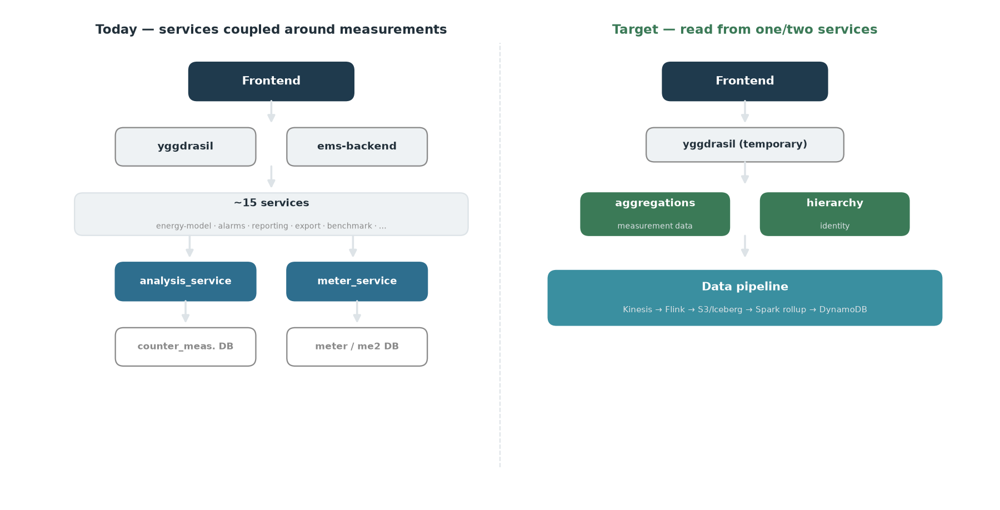
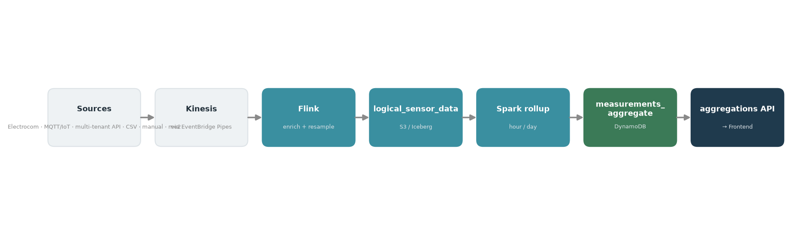
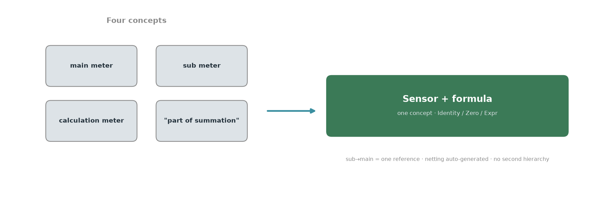
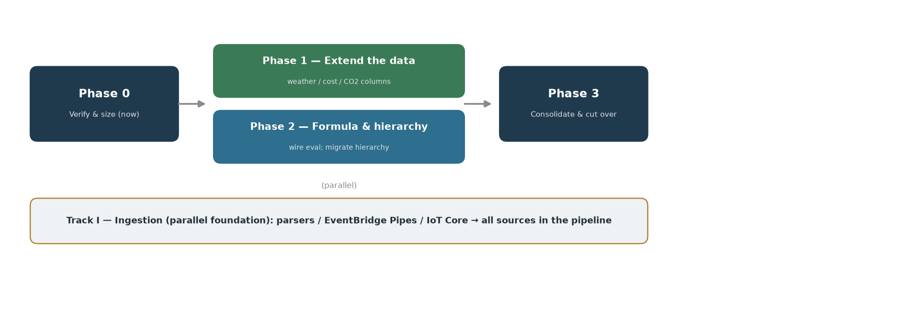

# Counter-measurement migration — working notes

> **Status:** working notes (not the final report). Last updated 2026-07-01.
> **Objective:** consolidate the frontend (and reporting) needs served today by **`analysis_service` + `meter_service`** onto **one or two common read services** on the new `ems_rust` pipeline (`aggregations` for measurement data, `hierarchy` for identity) — so the **frontend (and `yggdrasil` temporarily)** call only those, not the ~15 services fanning out to analysis/meter.
> **Stance — stepwise, not big-bang.** Retiring the legacy `ems-backend` (.NET monolith) + downstream services is the end goal, not the immediate task. No wholesale replacement of any one system in a single step.

## 1. Context & mapping

| emswt/main (old) | ems_rust (target) |
|---|---|
| `sensor_measurements` DB (raw) | S3 Iceberg `raw_data` |
| `counter_measurements` DB (logical) | S3 Iceberg `logical_meter_data` → rename **`logical_sensor_data`** (§5.5) |
| `analysis_service` (reads via `@enity/counter-query`) | `aggregations` Rust lambda (CQRS read, `crates/services/aggregations`) |
| `meter_service` (identity/hierarchy) | `hierarchy` service (`hierarchy_new`) + `meter-identity` |
| in-app + per-request compute | Spark/Glue rollup → DynamoDB `measurements_aggregate` + thin request-time compute |



**Migration seam:** `@enity/counter-query` has only 2 importers (`analysis_service`, `counter-ingestion`). Old read side = `analysis_service`; all endpoints are POST query-by-body (CQRS-read-shaped). It turns cumulative readings into consumption in-app (`RunningTotal`/`RunningArea`) then runs a 3-phase `prep→data→compute` pipeline.

## 2. Endpoint request/response patterns (`analysis_service`)

**pass-through** = straight DB read · **processing** = aggregation/computation. API defs: `emswt/main/packages/analysis-client/src/api-endpoints/`.

| # | Endpoint (POST) | Request | Response | Class | Caller / note |
|---|---|---|---|---|---|
| 1 | `api/counters/reading-count` | `counterIds`, `intervals[]` | per-counter counts | pass-through | `missing-manual-readings` (reminders). Not ingestion control |
| 2 | `api/counters/reading-bounds` | `counterIds` | `{first,last}` | pass-through | `energy-model-v2` uses `.first` (activation eligibility) |
| 3 | `api/counters/latest-reading` | `counterIds` | `{latest}` | pass-through | `yggdrasil` meter-list + `import-export` ("Latest Reading" col) — **frontend-facing** |
| 4 | `api/meter-data/filter-query` | `meterFilter`,`interval`,`resolution?` | per-meter series | processing | resolve meters → delta+time-weighted rollup → compute |
| 5 | `api/meter-data/details-query` | `meterDetails`,… | = #4 | processing | #4 without meter resolution |
| 6 | `api/meter-data/filter-groupby` | `meterFilter`,`groupBy[]` | nested `groups[]` | processing | rollup + hierarchy group-agg |
| 7 | `api/meter-data/details-groupby` | `meterDetails`,`groupBy[]` | = #6 | processing | #6 without meter resolution |
| 8 | `api/meter-data/aggregate` | `aggregations{interval,resolution}` | `aggregations{}` | processing | sum/avg/min/max over interval |
| 9 | `api/meter-data/values` | `requests[{interval,resolution}]` | per-meter values | processing (richest) | full compute pipeline — §5 |
| 10 | `api/key-values/sum` | `keys` | sum | processing — **likely out of domain** | uses `auxDataLayer`; confirm & exclude |
| 11 | `legacy/consumption/query` | legacy body | series | legacy | raw-URL; caller `ems-backend/Web`. Confirm traffic via `enity_analysis_legacy_consumption_count` |
| 12 | `legacy/zoom/query` | legacy body | zoomed series | legacy | raw-URL; callers `benchmark`,`co2-value`,`ems-backend/Web`. Confirm via `enity_analysis_legacy_zoom_count` |

**3 pass-through, 8 processing** (+1 aux to confirm).

## 3. Already implemented in ems_rust

**Spark/Glue rollup** — `infra/daq/data_pipeline/glue/measurements_aggregate.py` (`MeasurementsAggregateStack`, daq acct `891377204778`, hourly, `LookbackDays` default 1). Spec: `.../specs/2026-06-07-measurements-rollup-view-design.md`.
- **Source:** `all.logical_meter_data` (event-sourced; `resample_value` where `resample_method='time_proportional'`, dedup newest `ingested_time`).
- **Sink:** DynamoDB `measurements_aggregate` (TTL 90d hourly / 730d daily; GSI by dimension energy|volume|other).
- **hour + day only**; per `(node, resource, granularity, period)`: `sum, count, min, max, last_value, last_ts`.
- **Hierarchy pre-aggregated** at every ancestor level (company `HN2#` → leaf `L#`) → group-by is materialized.

**Read API** — `measurements-aggregations-api` (`crates/services/aggregations`), HTTP API `GET /meterdata/query/{action}`: `get_aggregations` (DynamoDB) · `get_measurements` (`raw_data` via Athena) · `/openapi.json` · `/docs`; `?format=html|json`.



## 4. Coverage overlay — old endpoints vs the existing rollup

| # | Endpoint | Covered? | Gap |
|---|---|---|---|
| 1 | reading-count | ✅ `count` | consumer likely out of scope (§9) |
| 2 | reading-bounds | 🟡 `last` yes; **first** not materialized | `first` needed only by `energy-model-v2` |
| 3 | latest-reading | ✅ `last_value`/`last_ts` | frontend-facing |
| 4/5 | filter/details-query | ✅ hour/day `sum` | off-grid resolutions (§6) |
| 6/7 | filter/details-groupby | ✅ strong (hierarchy pre-agg) | off-grid resolutions |
| 8 | aggregate | ✅ sum/min/max; avg=`sum/count` | arbitrary interval edges compose from stored hour/day periods |
| 9 | values | 🟡 base `sum` only | **compute layer** — §5 |
| 11/12 | legacy | ✅ hour/day equiv | finer zoom |

**Takeaway:** the rollup already collapses #1–#3 and the hour/day base of #4–#8/#11–#12 (incl. hierarchy grouping) into single-key DDB reads. Remaining work = the `values` compute layer (§5) + off-grid resolutions (§6).

## 5. Target compute model

### 5.1 Placement rule — denormalize, three lanes

**Rule: do every join once in the pipeline (broadcast-join tiny reference tables) and write results as columns on `measurements_aggregate`; the read stays a single keyed DDB query.** Read-time joins from S3/Iceberg (Athena) are seconds-slow, so nothing joins at read time. Denormalize as **columns, not rows** (row count unchanged); keep the 2–3 CO2 scopes as columns (`co2_scope_*`), cost in one base currency (convert at read) — cardinality stays flat.

> **Handler** = `analysis_service`'s unit of computation for one derived metric — a "value key" such as `energy`, `cost`, `co2`, `degree-days`, `active-hours`. A handler produces that metric's value series over the requested period through a 3-phase pipeline (declare prep/reference data → fetch counter data → compute), and handlers **compose** (e.g. the `cost` handler nests `energy` and multiplies by price). The `values` endpoint runs ~35 of them. The migration question is *where each handler's work belongs* — materialised in the pipeline vs computed in the read service. The three lanes:

| Lane | Handlers | Placement |
|---|---|---|
| **A · Spark rollup** | energy, flow, temp-in/out-avg, VWAT-numerator, computed-cooling, cooling-efficiency, hours, reading-count | Deterministic per-period aggregates. **energy/flow/temperatures each come from their own sensor** (a distinct `daq_id`; resource/`meter_type` assigned by `meter-identity`) — aggregate directly (temp avg = `sum/count`). **computed-cooling / VWAT are cross-sensor** (`flow·Δtemp`, `Σ(flow·temp)`, combining the flow + temperature sensors of one physical device — same `daq_id` up to `meterserial`) → they aggregate a *derived* series from the formula step (§5.5), time-aligned after resample, not raw readings. Extra columns: temp Σ+count, Σ(flow·temp)+Σflow, flow·Δtemp |
| **B · Flink stream** | active-hours, standby (+fraction/ratio/per-hour), op-hours mask | Need finer-than-period (sub-hour) resolution → pre-aggregate in the stream into daily `active_hours`/`standby_energy` columns |
| **C · Denormalized columns** (broadcast join) | cost (`energy×price`), CO2 (`energy×factor`), degree-days / climate-correct (weather), key-ratio, energy-budget | Reference tables are tiny → **broadcast-join once in Spark**, write columns. Keys: **weather on (location, date)** (node location from `meter-identity`); **factors on (resource/scope, validFrom)**. Mechanics in §5.3 |

Handlers suffixed `*-old` (`degree-days-old`, `energy-dda-old`, `normal-degree-days-old`, `co2-old`) + `energy-guf` are the legacy degree-day approach, superseded by model-based `climate-correct` — likely droppable (verify).


### 5.2 `measurements_aggregate` item shape (with §5.1 additions)

Keys unchanged: `pk="HN2#<hn2>"`, `sk="<path>#<resource>#<gran>#<period>"`, `gsi1pk="HN2#<hn2>#<dimension>"`, `gsi1sk="<path>#<gran>#<period>"` — `gran` + `period` (the hour/day label) live **in the sort key**, not as stored attributes; the **resource** (electricity/water/heat) is stored in an attribute still misnamed `purpose`. Additions land as **extra columns on the energy row** (functions of that row's `sum` + reference data) or **new derived-resource rows** (physically distinct series, different unit).

```jsonc
{
  "pk": "HN2#2",
  "sk": "HN2#2|HN3#9|HN4#456|L#10009#Electricity#d#2026-06-07",
  "gsi1pk": "HN2#2#energy", "gsi1sk": "HN2#2|HN3#9|HN4#456|L#10009#d#2026-06-07",
  "purpose": "Electricity", "unit": "kWh",   // "purpose" attribute holds the resource (misnamed)
  "sum": 123.4, "count": 24, "min": 0.1, "max": 9.7, "last_value": 90123.4, "last_ts": "2026-06-07T23:00:00Z",
  "cost": 246.8, "cost_ccy": "DKK",     // energy × price(period, tariff)
  "co2_s1": 12.3, "co2_s2": 9.8,        // energy × CO2 factor, per scope (columns)
  "hdd": 4.2, "cdd": 0.0,               // degree-days for this node's location/day (daily+ only)
  "energy_cc": 118.9,                   // climate-corrected energy
  "active_hours": 18.5, "standby_energy": 3.1,   // Lane B
  "updated_at": "2026-06-08T01:00:00Z", "ttl": 1783000000
}
```
Derived-resource rows (same schema) for flow+temperature meters: `Cooling, FlowVolume, TempInAvg, TempOutAvg, VWAT`; avg = `sum/count`.

Open schema decisions: (1) `hdd`/`cdd` repeat per resource row at a node — accept duplication (single-read) vs a `DegreeDays` row (adds a lookup); leaning accept. (2) item-size × row-count acceptable — gated on the §10.1 sizing.

### 5.3 Weather / CO2e / prices — realization

Own each as a small reference table; the Spark rollup broadcast-joins and writes columns (§5.1).

**How the join works:** the aggregate row already carries the node's hierarchy + resource; add the node's **location** (from `meter-identity`) and Spark broadcast-joins two in-memory tables — `weather(location, date) → hdd, cdd, normal` (from Weatherbit) and `factors(resource/scope, validFrom) → price, co2` — with no shuffle, then computes and writes `hdd / cdd / energy_cc / cost / co2_scope_*`. `hdd`/`cdd` are per-location, so they sit on **location-bearing nodes** (building and below); `cost`/`co2`/`energy_cc` are **additive** (computed at the leaf with local weather, summed up the hierarchy).

**Finalization uses existing machinery, no bespoke trigger for the common case:** set **`LookbackDays ≥ 5`** so the recent window is re-baked as forecast HDD/CDD (or restated factors) finalize; reads are ≤1 rollup-cycle stale. A `(location, date)` late-trigger (existing `late_arrival_trigger`/`late_recomputation`/`backfill_trigger` shape) is a **fallback only** for restatements older than the window. Prereq: **location on `meter-identity`** (lat/lon or weather-location id). Weather is greenfield in ems_rust (only in a spec).

### 5.4 Service-vs-data boundary — what stays in the read service

Everything that can be data is data (pipeline → `logical_sensor_data` + `measurements_aggregate` columns). The read service keeps only:

| Stays in service | Why |
|---|---|
| Access / permission filtering | Per-user (writes/reads/blocked edges); rollup holds all nodes |
| Query orchestration / response shaping / validation | The CQRS surface |
| Request-param selection & scalar scaling | scope pick (`co2_scope_*`), currency, unit/display, budget scenario, tunable base-temp — select/scale over columns |
| Ratio / division metrics | VWAT, efficiency, key-ratio, per-hour — divide of two rolled-up sums (numerators pre-baked) |
| Resolution re-agg + interval edges | week/month/year from daily; intervals not aligned to the hour/day grid |
| Ad-hoc cross-node / cross-period comparison | benchmarking, this-vs-last |
| Transition "meter" grouping | meter → its `logical_id`s, until derived sensors cover it |

### 5.5 Sensor & formula model; the meter hierarchy

**No meter entity.** The model is typed hierarchy nodes + **sensors** (`S#<int>`, attached via `has_sensor`), each with `purpose` (the **resource** — electricity/heat), `meter_type` (Counter|Gauge), `unit`, `resample_minutes`, and a **`formula`** (`Identity`/`Zero`/`Expr`; `Expr` refs other sensors' computed `S'`, `+ - * / abs`, company-scoped, cycle-checked). A **raw sensor reading carries only `{daq_id, timestamp, value, unit}`** — everything else (`logical_id`, hierarchy `hn2..hn9`, resource, `meter_type`, resample) is assigned by **`meter-identity` enrichment keyed on `daq_id`**. The `daq_id` is structured `protocol:schematype:customer:gatewayid:meterserial:sensorid`; **sensors on the same physical device share all but the final `sensorid`**. So there is no "meter with counters": each measurement (energy, flow, forward-temp, return-temp — and on modern meters many more: energy tariffs, production, per-phase, …) is an **independent sensor** with its own `daq_id`/`logical_id`, and the "same physical meter" grouping is just the shared `daq_id` prefix (up to `meterserial`). (The old `TaellerNr` 1/2/3/10/11 is a legacy convention, not a fixed structure — §10.2.) `logical_meter_data` is keyed per `logical_id` → rename **`logical_sensor_data`**; a "meter" during switchover = the set of sensors sharing that prefix.

**Formula status:** the system is implemented (AST + tested `eval`, parser, `attach`/`set_formula`, API, and `formula` is propagated into `meter-identity`) — but **not applied to the time-series**: the hierarchy `evaluate` reading-hook is a stub and the Flink/Glue pipeline has zero formula references. So no derived series exists yet. **Build gap:** a pipeline step running `eval()` per reading, resolving cross-sensor `Ref`s (time-aligned sibling values); formula change → late-recompute. (Evaluate in the pipeline, never at read time.)



**Meter hierarchy = one relationship, not a parallel tree.** The old main/sub tree exists only to avoid double-counting, and main/sub **legitimately crosses buildings**, so the netting relationship is independent of the location hierarchy. Represent it as **one "part-of-main" reference per sub-meter** (cross-node, company-scoped); the netting formula (`main = self − Σ subs`) is **auto-generated and re-derived** from it (add/remove a sub → parent updates; preserves the auto-maintenance the old summation flag gave for free). This is a per-sensor computation DAG, **not** a navigable second hierarchy — and it drops all the old machinery (separate meter tree, `Part of summation` flags, query-time summation contexts, area/context modes). Hand-authored `Expr` is reserved for genuine derived metrics (COP/ratios).

**Old → new mapping:** sub-meter = identity leaf; main = netting parent (auto-derived); calc meter (`counter.formula` over `[meterId:counter]` tokens; `MeterBasedFormulaTranslator` exists) = `Expr`; not-part-of-summation = `Zero`. All four old types collapse into the one formula/sensor concept.

## 6. Resolution strategy

- **hour + day:** materialized (done).
- **week / month / year:** compute **in-service** from the 730-point daily series (÷7 / ÷30) — do not materialize; not worth the DDB cost.
- **15-minute:** deferred — a DDB storage-cost decision, gated on real frontend need.

## 7. Adjacent context: `meter_service` (identity plane)

A different bounded context — the identity/hierarchy/metadata registry (its own `me2db` + meter DB; reads **no** measurement DB). Owns meters/sensors/counters, buildings/hierarchy, tags, units, operational-hours, documents, custom fields, ownership. **15 consumers** via `@enity/meter-client`. Role in the measurement path: resolve `meterFilter` → meters + hierarchy (the "which meters" behind "what values").

**Target:** → `hierarchy` service + `meter-identity`, **not** the aggregations service. The measurement read path should read from `meter-identity` (identity/hierarchy is already denormalized into the data), never call a meter service at query time. Enrich `meter-identity` as a **lean read projection** (candidates: reading-type, operational-hours, location, tags, and the **counter-role** that replaces `TaellerNr` — primary / secondary / temperature — expressed as `resource` + `meter_type`, not a counter number; add an explicit `primary` marker only when a node has two energy sensors), fed by registry change events; per field decide **stamped-at-write** (point-in-time, like the hierarchy path) vs **looked-up-at-read** (current, e.g. tags) — getting it wrong silently rewrites history.

## 8. Raw side: `sensor_measurements` / `raw_data` readers

The analytics/frontend path does **not** read raw (it's all on logical). Consumer read of raw = the **datatilegnelse** view → `get_measurements` over `raw_data` via Athena. Direct raw readers are pipeline/quality (`counter-ingestion` transform, `sensor-measurements-stat-manager`, `-missing-readings-manager`, `-management`, `-ingestion`) → Flink/Glue. **One outlier:** `ok-carwash-api` reads raw via `sensor-measurements-management` (`fetchAdjustedReadings`) for per-car-wash consumption → **MARKED FOR UPDATE**: repoint to `raw_data`/Athena or the logical path.

## 9. Consumer classification (analysis/meter → common service)

Disposition = what happens to the service in the target end-state:
- **client** — the service **keeps existing as its own service**, but is **repointed to call the new common service(s)** (`aggregations` / `hierarchy`) instead of `analysis_service` / `meter_service`. Its own logic is unchanged; it's still a consumer, just of the new backend. (Here "client" means "a caller of the common service" — not the `@enity/*-client` HTTP libraries.)
- **subsumed** — the service's functionality is **absorbed into the common service**, and the separate service is **retired**.
- **eliminate / collapse** — a **thin intermediary** whose callers are **all** entry points (`yggdrasil` / `ems-backend`); once those call the common service directly, it **disappears** — no separate service, nothing to repoint. Higher-value than *client*: it shrinks the middle tier instead of preserving it. (If it has real domain logic, it's *subsumed*, not eliminated.)
- **out of scope** — a **different bounded context**; not part of this consolidation (left as-is or handled elsewhere).

> **Repoint is a migration step, not the destination.** "client/repoint" only stops a service reaching into `analysis_service`/`meter_service` internals — it reads the clean common API instead. If we stop there we've just relocated the hard coupling one layer down. The **end-state** for each consumer is one of: **fold** its measurement/identity logic into `aggregations`/`hierarchy`; **re-home** a genuinely separate domain (alarms, reporting/CSRD, ML) as its *own* clean bounded-context service the frontend calls as a peer (owns its data, loose coupling via events/APIs — not a middle-tier pass-through); or **retire**. The table below is the *first* move; the fold-in/re-home is the target.

| Consumer | Uses | Disposition |
|---|---|---|
| `yggdrasil` | analysis (latest-reading + most) + meter | **client** (temporary frontend façade) |
| `consumption-api` | analysis aggregate/values; meter | **subsumed** (it *is* a consumption read API) |
| `import-export` | analysis latest-reading + query; meter | **client** (reporting) |
| `energy-model-v2` | analysis reading-bounds.first + aggregate/values; meter | **client** (needs `first` bound) |
| `alarm_runner` | analysis filter-query; meter | **client** (alarms) |
| `computed-benchmark` | analysis filter-groupby/values | **client** (benchmarks) |
| `report-runner` | analysis filter-groupby/details-query; meter | **client** (reporting) |
| `export` | analysis aggregate; meter | **client** |
| `energy-model-service` (v1) | analysis filter-query/values; meter | **client** (verify legacy vs v2) |
| `ok-carwash-api` | analysis values; + raw (§8) | **client** |
| `alarm-management` | meter only | **client** (identity) |
| `climate_reporting_service` | meter; via yggdrasil | **client** |
| `missing-manual-readings` | analysis reading-count; meter | **out of scope** (manual-reading workflow) |
| `energy-cost` | meter only | **out of scope** (pricing; identity client) |
| `back-office` | counter-ingestion admin | **out of scope** (pipeline ops) |
| `ems-backend/Web` | analysis legacy endpoints | **out of scope** (legacy monolith) |

**Feasibility confirmed:** every meter call = identity/hierarchy (→ hierarchy service); analysis calls concentrate on filter-query/filter-groupby/aggregate/values (→ aggregations, covered except the §5 compute layer). 1 subsumed, ~8 client, rest out of scope. The only real blocker to "frontend calls one service" is the §5 compute layer, not consumer breadth.

**Alternative lens — collapse the middle tier (don't just repoint).** Most "client" services sit in a sandwich: `frontend → yggdrasil / ems-backend → {service} → analysis/meter`. A middle service that is **(1)** reached *only* via entry points (yggdrasil/ems-backend) **and (2)** a thin reshape over analysis+meter can be **eliminated** — the entry point calls the common service directly. This is the higher-value move: it shrinks the distributed monolith rather than preserving it. Deciding it needs both filters — the **caller graph** (all callers = entry points?) and a **logic-depth** check (thin reshape vs real domain logic). First pass (caller graph via client-pkg importers):

| Middle service | Callers | Filter 1 (entry-only?) | Disposition |
|---|---|---|---|
| `computed-benchmark` | yggdrasil only | ✅ | **collapse candidate** — verify benchmark logic is thin / a query pattern |
| `import-export` | yggdrasil only | ✅ but **20k LOC** import/export domain → **fails filter 2** | stays **client** (repoint data-fetch only) |
| `energy-model-v2` | analysis_service + ems-backend + yggdrasil | ❌ multi-caller | stays **client** (shared dep + real ML) |
| `alarm-management` | ems-backend + user_service + yggdrasil | ❌ multi-caller | stays **client** (alarms domain) |

So `client` in the table above is the *conservative* disposition; several entries may become **eliminate/subsumed** once the full caller-graph + logic-depth pass is done (open §13).

### 9.1 Subsumability estimate (logic-depth pass)

Rough sizing + logic shape (src LOC excl. tests). "Subsume" = fold into the common aggregation service; otherwise it stays its own service and just **repoints** its measurement reads (client).

| Service | LOC | Logic character | Subsume? |
|---|---|---|---|
| `consumption-api` | 4.7k | consumption read/reshape over analysis (+ some `me2db`, response schema) | **Yes — easy-ish.** It *is* a consumption read API = the common service. Its `me2db` reads are meter/hierarchy (`Maaler`/`Firma`/`Energiform`) → available from hierarchy + `meter-identity` (not a blocker); only real wrinkle is the response schema |
| `computed-benchmark` | 2.2k | benchmark calc (~200 LOC) **+ its own results DB** | **Yes — moderate.** Port the calc; its DB → a rollup/materialized view or query pattern. (Only-via-yggdrasil → also an eliminate candidate) |
| `ok-carwash-api` | 1.3k | bespoke car-wash config + export builder | **No — stays** (product edge; small; repoint + §8 raw-read) |
| `export` | 2.4k | async export-**job** subsystem (queue/jobs/file gen, own db) | **No — stays.** Different concern (job orchestration); repoint data-fetch only |
| `import-export` | 20k | import/export domain (formats, mappings) | **No — stays.** Repoint data-fetch only |
| `energy-cost` | 6k | price-list / cost-factor **registry** (`cost-factor-service`, `price-list-service`) | **Reference-data owner now; replace later.** It owns the price/CO2-factor tables the pipeline broadcast-joins (§5.1 Lane C); cost-*compute* moves to the denormalized column. Since **we plan to own prices** (§5.1), the registry itself becomes a **replace/retire candidate** — move price/factor ownership into the new system, feed the pipeline directly, drop `energy-cost` (a later simplification). Its `me2db` reads are hierarchy/meter (available) |
| `energy-model-v2` / `-service` | 5.6k / 4.4k | ML regression modeling | **No — stays** (distinct capability) |
| `alarm_runner` / `alarm-management` | 5.2k / 16.7k | alarm evaluation engine + config | **No — stays** (alarms domain) |
| `report-runner` | 9.2k | report generation (custom/KPI/week, templates, notifications) | **No — stays** (reporting domain) |
| `climate_reporting_service` | 6.9k | CSRD compliance (emission types/scopes/fields, exports) | **No — stays** (compliance domain) |

**Estimate:** `consumption-api` (easy) and `computed-benchmark` (moderate) fold in now; the rest **repoint first** and then reach their end-state as their domains are rebuilt — measurement/identity logic **folds into** `aggregations`/`hierarchy`, genuine domains (alarms, reporting/CSRD, ML) **re-home** as clean bounded-context peers, `energy-cost` becomes a reference-data owner then retires. **Repoint alone is not the goal** — it breaks the analysis/meter coupling but, left there, just relocates it. The near-term consolidation is modest; the destination is a small set of context-owning services, loosely coupled, that the frontend composes from — not a fan-out of middle-tier services.

**me2db reads are hierarchy + meter identity — not a migration blocker.** The services that hit `me2db` directly (`consumption-api`, `energy-cost`, `report-runner`, `climate_reporting_service`) pull almost entirely **hierarchy** (`Bygningselement`, `Firma`, `Adresse`, recursive-hierarchy CTEs) and **meter/sensor identity** (`Maaler`, `Taeller`/`FysiskTaeller`, `Energiform`/`EnergiHovedgruppe`, `Grundenhed`/base-unit/meter-type) — exactly what the new **hierarchy service + `meter-identity`** already hold. So these direct me2db reads are **repoint targets, not blockers**: swap to the new identity/hierarchy source. The only residual is **user/access/recipient data** (`Bruger`, `DataadgangBrugerFirma`, profiles, contact-users — mostly `report-runner` for report distribution) + i18n (`sprog`). This isn't a separate context either: the **hierarchy service already owns users** (`U#<email>` rows, access/block edges, Cognito provisioning). During switchover it needs a **sync path** — the ME2 monolith already CDC-streams *all* entity changes (users included) via the `Me2Events` table → **`me2-events`** Kafka topic (`me2-event-stream`); a consumer projecting user/hierarchy changes into `hierarchy_new` keeps the new system in sync until it becomes the source of truth.

## 10. Verification plan

Before committing schema/pipeline changes, verify two models against the current system on real data.

### 10.1 Reference-data model (weather · CO2e · prices)

1. **Inventory + keys.** Weather: choose the location key (Weatherbit lat/lon) and confirm every measuring sensor resolves to a location (add lat/lon or weather-location id to `meter-identity`). CO2e: enumerate factors + scopes (`@enity/energy-cost-client`), confirm scope count `S` and `validFrom` versioning. Prices: enumerate tariffs/currencies/versioning; confirm per-region/standard (denormalizable) vs per-tenant contract (cardinality risk).
2. **Linearity / join-once validity.** Confirm cost & CO2 are pure `energy × factor(t, scope)` → safe to compute per leaf row and sum up the hierarchy. For degree-days/climate-correct, confirm base temp (fixed `hdd@17`?) and whether correction is a per-`(location,day)` join or a per-meter fitted model (the latter needs a stored model, not just a weather join).
3. **Sizing (open item).** Compute M/N/R/L/S → `measurements_aggregate` row count + item-size delta from the new columns; confirm DDB storage/cost acceptable; confirm reference tables stay O(L×days)/O(S×validFrom).
4. **Finalization horizon.** Confirm Weatherbit provisional→final horizon ≤ chosen `LookbackDays (≥5)`; verify the recent window re-bakes each run. Decide whether factor/price restatements ever apply beyond the window (→ need the fallback `(location/scope, date)` trigger).
5. **Parity harness (the actual verify).** For a sample of nodes/periods, compute cost / CO2 / degree-day-adjusted energy **both ways** — old `analysis_service` `values` vs the new Spark-denormalized columns — and diff within tolerance. Investigate mismatches (unit conversion, base-temp, scope selection). Iterate to parity.
6. **Temporal correctness.** Verify point-in-time semantics: cost/CO2 use the factor valid at consumption time (not current); historical rows keep weather/factor as-of that day. Test a factor change and a hierarchy move; confirm history isn't silently rewritten.

### 10.2 Meter-hierarchy extraction (sub→main + calc formulas)

1. **Extract raw relationships** from me2db/meter DB: `meter → parent_meter` (main/sub forest), `isPartOfCalcMeterSum` (summation flag), `counter.formula` + `CounterType.Formula` (calc meters, `[meterId:counterIndex]` refs), meter→counters (`TaellerNr`) → `logical_id`/`daq_id` mapping — **note 1/2/3/10/11 is a *legacy convention*, not universal**: it's primary/secondary consumption + fwd/return temp (`[10,11]` hardcoded as gauge/temperature in counter-ingestion), but modern meters report many measure types (energy tariffs, production, volume, temps — see the ECM-Bus `config-matcher`), so extract the actual `TaellerNr` set per meter rather than assuming five slots; in the new model each measure is its own sensor sharing a `daq_id` up to `meterserial`, `meter_type` from enrichment. Area → explicit meter-id lists.
2. **Audit calc-meter grammar.** Parse all `counter.formula`; enumerate operators/functions; confirm they fit `+ - * / abs` + refs. Flag anything richer (min/max/conditional/time) for handling or grammar extension.
3. **Audit summation modes.** Quantify context (building) vs area (explicit list) vs arbitrary; count cross-building main/sub (legit → cross-node part-of refs); confirm no cross-company refs.
4. **Derive new-model artifacts.** `parent_meter` → one `part-of-main` ref per sub → generated netting formula `main = self − Σ(part-of-summation subs)`; calc meters → `Expr` (translate `[meterId:counter]` → sensor `Ref`s via counter-index→resource); not-part-of-summation → `Zero`. Relationship is the source of truth; formula is generated.
5. **Diff harness (the actual verify).** Per sample company: recompute node/company totals from the derived formulas (Σ computed `S'` over the subtree) vs current `analysis_service` summation output per context; diff within tolerance; investigate mismatches (double-counting, missing subs, translation errors, context edge cases). Can run offline using the model's existing `eval` — **independent of the pipeline formula-wiring** (§5.5 gap).
6. **Cutover gate.** Companies that pass → migrate mechanically; residual mismatches → interim dual-run keeping old semantics until resolved.

## 11. Later — user-friendly formula authoring

Users should not type formulas for the common cases. Instead, illustrate the **company hierarchy tree** and let them pick, generating the formula underneath:

- **Sub-metering:** pick a meter (possibly in another building) from the tree → added to the parent as a **subtraction by default** (creates the `part-of-main` ref → auto-netting).
- **Combine two sensors as one:** mark both as **`Zero`** (excluded from normal aggregation) and create a derived sensor with `s1 + s2` — mirroring today's behaviour.
- Formulas stay the substrate; tree-picking gestures compile to them. Raw `Expr` authoring is the power-user escape hatch. Decide + user-test this **separately** from adopting the engine — the redesign, not the engine, is the UX lever (the current main/sub/sum/calc model is what confuses users).

## 12. Path ahead — proposed sequencing

Stepwise, **verify-before-build**. After a shared verification phase, the two build tracks (data-denormalization and formula/hierarchy) are independent and run **in parallel**; consolidation/cutover comes last. Note: **validation is per company; the cutover itself is a shared switch** (multi-tenant pipeline/services — see Phase 3), so "company by company" applies to *checking*, not to running old and new side by side per tenant.

**Track I — Ingestion completeness** *(parallel foundation; the pipeline must carry **all** measurements before the read side can replace analysis).* Measurement sources still on the legacy **eventlogger** Kafka topics get redirected into the new **Kinesis** stream via **EventBridge Pipes** — the mechanism already live for **me2-events**. Per source:
- **Electrocom** — write the data-pipeline parser (the hardest; python/ts reference code already exists to port).
- **Catch-all MQTT** (`mqtt-ext-broker` / `mqtt-emqx`) — reroute through **AWS IoT Core** (native pipeline path) rather than a bespoke parser.
- **Brunata / Datahub / Aalborg Forsyning / Danfoss / Techem** — move to the **`multi_tenant_api`** (API-based ingestion; no parser).
- **CSV** — the new **`csv_parser`**.
- **Manual meter updates** — arrive **through the pipe** (EventBridge Pipe → Kinesis).
- **Kinect** — **dead**; decommissioned, nothing to migrate.
- *Exit:* every active source lands in `logical_sensor_data` via the new pipeline → the legacy eventlogger/ingestion services can be retired.



**Phase 0 — Verify & size** *(now; read-only, parallel; these are the go/no-go gates).*
- **Meter-hierarchy diff harness** (§10.2) — run offline via the model's `eval` (no pipeline dependency); validate sub→main + calc-formula derivation vs current summation, per company. → gates Phase 2.
- **Reference-data parity harness** (§10.1) — old `values` vs new denormalized cost/CO2/degree-day columns. → gates Phase 1.
- **Data-volume sizing** (M/N/R/L/S) — confirm the denormalized DDB item is affordable.
- **Frontend call pattern** (values #9 vs aggregate/groupby) + **legacy-endpoint traffic** (metrics) — scope the real critical path.
- *Exit:* derivation + parity within tolerance; sizing OK; critical path known.

**Phase 1 — Extend the data** *(additive, low-risk; parallel with Phase 2; gated on §10.1 + sizing).* Additive to the existing rollup — current reads untouched.
- Add **location** to `meter-identity`; stand up the **weather** ref-table (Weatherbit) + broadcast-join into the rollup; `LookbackDays ≥ 5`.
- Own **price/CO2 factor** ref-tables; broadcast-join **cost/CO2 columns**.
- Add **Lane A** columns (temp/flow/cooling/VWAT-numerator).
- Rename `logical_meter_data → logical_sensor_data` (sequence with column changes; S3Tables replace).
- *Exit:* `measurements_aggregate` carries the denormalized columns; reads stay single-key.

**Phase 2 — Formula & hierarchy** *(the hard prerequisite; parallel with Phase 1; gated on §10.2).*
- **Wire formula `eval` into the pipeline** (company-scoped, cycle-safe, cross-sensor refs) → derived-sensor rows.
- **Migrate the meter hierarchy**: old `parent_meter` → `part-of-main` refs (auto-netting), calc meters → `Expr`; populate + validate **company by company** (offline diff harness §10.2) — the derivation is per-company *data*, so it can roll out and be checked one company at a time.
- Add **Lane B** Flink columns (active-hours/standby).
- *Exit:* cross-sensor physics + netting materialized; company-by-company parity.

**Phase 3 — Consolidate & cut over** *(last).*
- Extend the **`aggregations`** service to the full analysis surface (filter/groupby/aggregate/values + service-side ratios/resolutions/access-filtering, §5.4).
- **Subsume** `consumption-api`; **collapse** `computed-benchmark`; **repoint → fold/re-home** the client services (§9.1).
- **Cutover is a shared switch, not per tenant.** The pipeline + services are multi-tenant, so once validation passes across companies, reads move to the new services **globally** — stageable by **capability/endpoint** (e.g. `get_aggregations` first), not by company. *Per-tenant* cutover would need **dual ingestion** (both pipelines fed) + **per-tenant frontend routing**; that's a separate decision, not assumed here. Retire **legacy endpoints** once metrics show zero traffic.
- *Exit:* frontend (via yggdrasil temporarily) reads only `aggregations` + `hierarchy`.

**Cross-cutting** *(throughout switchover).*
- **me2-events CDC sync** → project user/hierarchy/access changes into `hierarchy_new`/`meter-identity` until cutover flips source-of-truth (§13 item 13). Treat as one transition-sync design, not user-specific.
- **Own prices** → later; retire `energy-cost` (§9.1).

**Recommended first move:** the **§10.2 meter-hierarchy diff harness** — it validates the biggest thesis (formula derivation), runs offline with no pipeline dependency, and gates the largest build (Phase 2). Every expensive step downstream is gated on Phase 0.

## 13. Open questions

**Decided:** denormalize (no read-time joins); columns not rows; `LookbackDays ≥ 5` for weather (trigger only as fallback); week/month in-service; formulas as the single substrate with auto-maintained netting; no parallel sensor hierarchy; one/two common services (aggregations + hierarchy) — feasibility confirmed (§9).

**Open:**
1. **Data-volume sizing** (§10.1.3) — M/N/R/L/S → confirm item-size/cost before schema-freeze.
2. **`meter-identity` enrichment** (§7) — which fields (reading-type, operational-hours, location, tags, **counter-role**?), each stamped-at-write vs read-time. Counter-role replaces the `TaellerNr` primary/secondary/temperature convention (consumers: `meter_service`, `energy-model-v2`, `consumption-api`, `ok-carwash-api`, `report-runner`) — expose as `resource`+`meter_type`, don't carry the counter number forward.
3. **Wire formula `eval` into the pipeline** (§5.5) — the prerequisite for cross-sensor physics in the data; run the §10.2 diff harness offline first.
4. **Rename `logical_meter_data` → `logical_sensor_data`** (S3Tables rename = replace + reload; sequence with column changes).
5. **Extra columns** — Lane A (temp Σ+count, Σ(flow·temp)+Σflow, flow·Δtemp) + Lane C (`hdd,cdd,energy_cc,cost,co2_scope_*`); Lane B daily (`active_hours,standby_energy`).
6. **Meter-hierarchy migration** (§10.2) — mechanical vs interim dual-run per company, gated on the diff harness.
7. **User-facing model** (§11) — auto-netting + unified concept vs formula authoring; user-test.
8. **Verify legacy consumers** — `energy-model-service` v1 vs v2; `benchmark`/`co2-value` vs `computed-benchmark`; `ems-backend/Web` legacy endpoints (traffic via the `legacy_*_count` metrics).
9. **Confirm `key-values/sum` (#10)** is aux → exclude. **First-reading bound (#2)** — rollup vs on-demand (only `energy-model-v2`).
10. **`ok-carwash-api`** (§8) — repoint raw read.
11. **Frontend call pattern** — does it hit `values` (#9) or mostly `aggregate`/`groupby`? Decides how much of §5 is on the critical path.
12. **Middle-tier collapse (§9.1 done, first pass)** — logic-depth estimate: only `consumption-api` (easy) + `computed-benchmark` (moderate, also eliminate candidate) are subsumable; the rest stay clients that repoint. `import-export` fails the thin-filter despite being only-via-yggdrasil. Remaining: confirm `consumption-api`'s `me2db` reads + `computed-benchmark`'s DB→rollup path; verify each "stays" service has no other thin-reshape endpoints worth folding.
13. **User sync during switchover (§9.1)** — hierarchy owns users, but while me2db is still authoritative, project user/access changes into `hierarchy_new` by consuming the existing **`me2-events`** CDC topic (`Me2Events` → `me2-event-stream`). Scope the consumer (which `Me2Events` entity types → hierarchy nodes/users/access edges) and the cutover point where the new system becomes source of truth. (Adjacent to counter-measurement scope — transition dependency.)
14. **Cutover model (§12 Phase 3)** — default is a **shared switch**: cut reads over globally, staged by capability/endpoint, once validation passes across companies. **Per-tenant** cutover (company-by-company live switch) is only viable with **dual ingestion** (old + new pipelines fed in parallel) + **per-tenant frontend routing** — decide whether that's worth building, or whether a global/capability-staged cutover is accepted. Per-company *validation* is independent of this and stays either way.
