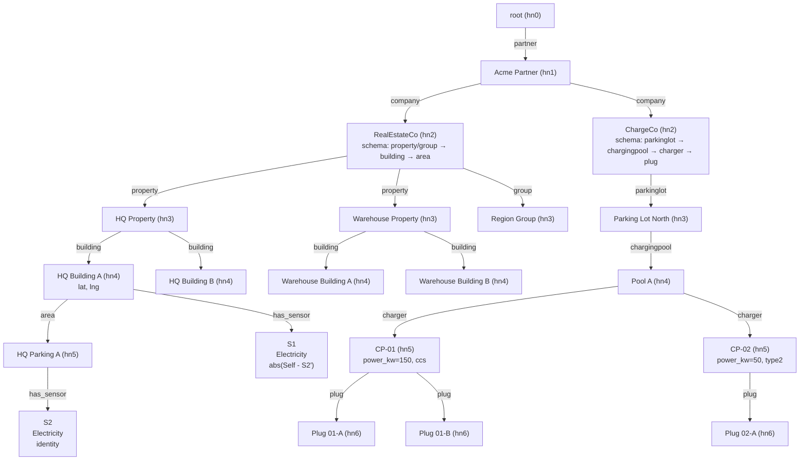
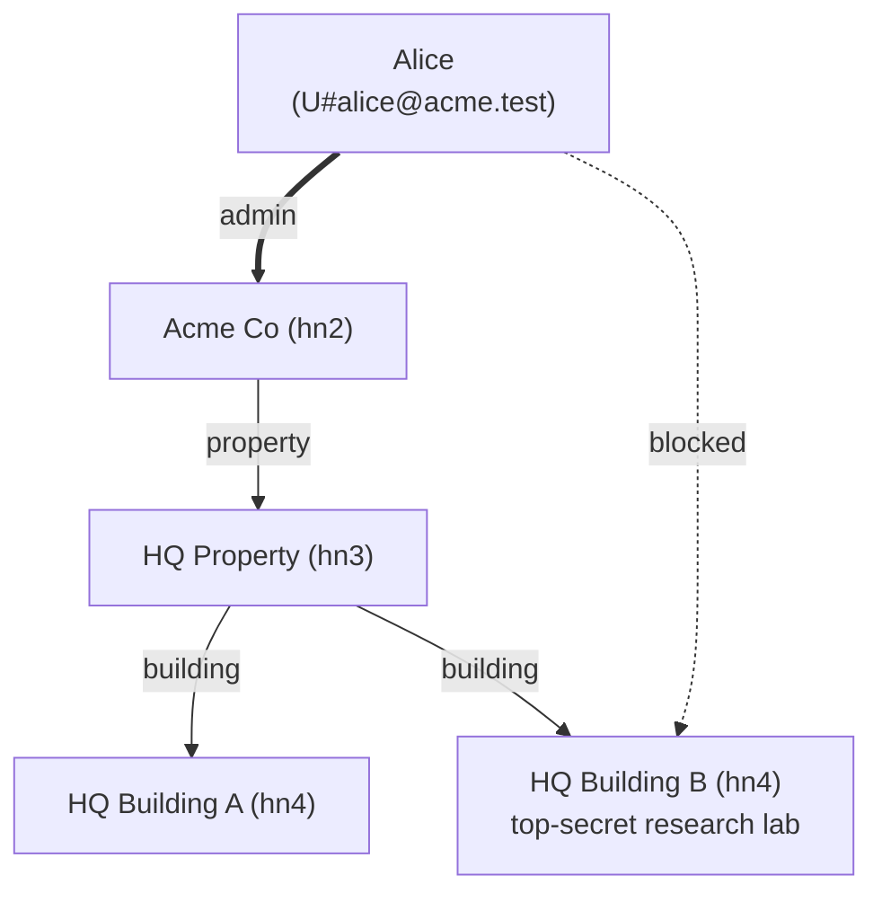
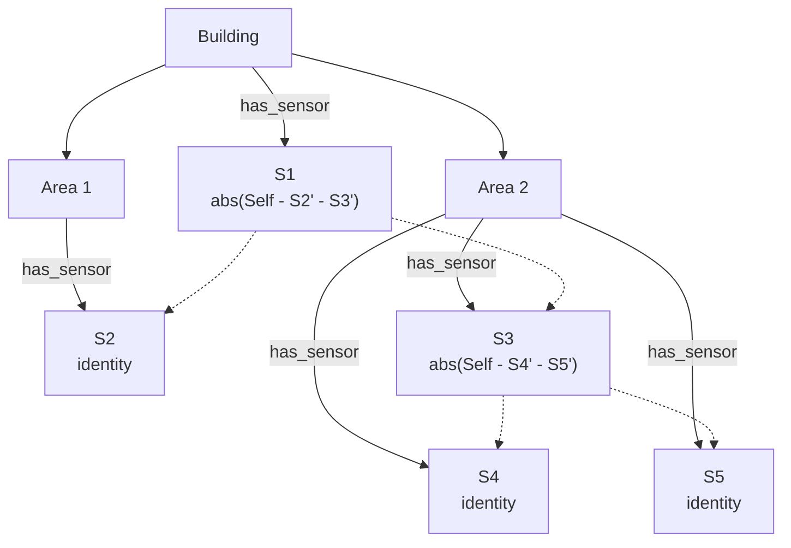
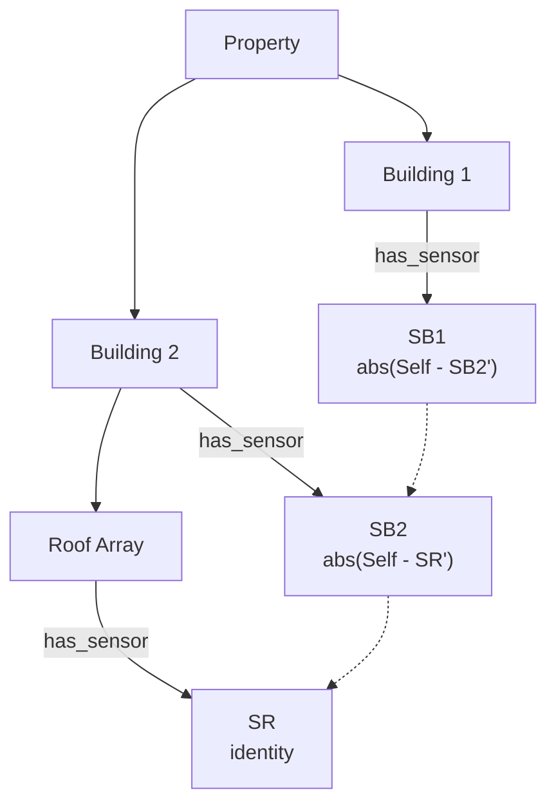

# Hierarchy and Sensors

Living reference for the node model, the per-company schema, the sensor model,
and the DynamoDB layout that backs all of them. Kept in sync with `lib/`.

See `docs/api.md` for the HTTP surface, `docs/architecture.md` for how these
domain concepts are packaged into layers.

---

## 1. Node model

A tree of typed nodes rooted at a singleton.

| Level | Role              | Notes                                                |
|-------|-------------------|------------------------------------------------------|
| hn0   | root              | singleton, id = `HN0#<nil-uuid>` (`Node_id.root`)    |
| hn1   | partner           | business tenant, e.g. "Acme Partner"                 |
| hn2   | company           | **owns a schema** that shapes everything below it    |
| hn3…9 | schema-defined    | meaning is whatever the owning hn2 schema declares   |

Every node carries:

- `id` — `HN<n>#<uuid>`
- `level` — derived from `id` (not stored separately)
- `name` — human label
- `parent` — parent node id (root has `None`)
- `created` — `Ptime.t`, serialized as RFC 3339
- `metadata` — free-form JSON, validated against the schema for that level
- `schema` — only present on hn2

Depth must **strictly** increase from parent to child. Cross-level shortcuts
(e.g. `hn2 → hn4` skipping `hn3`) are allowed **if** the schema declares that
edge. The actual edge pair stored is `(parent_level, child_level)`, not a hop
chain.

---

## 2. Per-company schema

The schema lives on the hn2 node and governs *that* company's subtree only.
Sibling companies can have completely different shapes.

```ocaml
(* lib/domain/schema.ml *)
type edge_spec = { label : string; min : int option; max : int option }

type t = {
  version  : int;
  edges    : (Level.t * (Level.t * edge_spec list) list) list;
  metadata : (Level.t * (string * Metadata.field_spec) list) list;
  sensors  : Level.t list;
}
```

### 2.1 Edges

Each `(parent_level, [(child_level, specs)])` entry declares one or more
labeled edges between two levels. `specs` is a **list** so the same
`(parent_level, child_level)` pair can host multiple distinct relationships —
e.g. `hn2 → hn3` as both `property` and `group`.

`min` / `max` express cardinality per parent. Only `max` is enforced at write
time; `min` is informational.

### 2.2 Level resolution at add_node

`Hierarchy.add_node` takes `?level`; the API accepts an optional `level` field.
Resolution:

- **`hn0 → hn1`** and **`hn1 → hn2`** are hard-coded (partner, company).
- **Schema-gated levels (`hn2+`)**:
  - No `label` → default to parent+1. Error if that level has zero or multiple
    candidate edges.
  - `label` given → the unique target level in the schema whose edge list
    contains that label. Error if 0 or >1 target levels match.
  - An explicit `level` overrides inference; the `(parent_level, level, label)`
    triple must resolve to exactly one edge spec.

### 2.3 Metadata specs

`metadata` maps each level to the required/optional JSON fields for nodes at
that level. Supported `Metadata.field_type`:

| type        | constraints honoured                         |
|-------------|----------------------------------------------|
| `string`    | `min_len`, `max_len`                         |
| `number`    | `min`, `max` (float)                         |
| `integer`   | `min`, `max` (int64)                         |
| `boolean`   | —                                            |
| `timestamp` | must parse as RFC 3339                       |
| `enum`      | `one_of` (non-empty list of allowed strings) |

Each field carries `required`. Unknown fields are ignored, not rejected.

### 2.4 Sensors list

`sensors : Level.t list` names the levels that may host sensors.

### 2.5 Schema resolution

`Schema_check.find_for id` walks up from `id` until it hits an hn2 with a
schema. The hn2's schema is authoritative for the whole subtree. Missing hn2
ancestor → `Schema_missing`.

---

## 3. Example: two companies, two shapes



Two invariants worth calling out — both asserted in `itest/test_dynamo.ml`:

1. **RealEstateCo has no `charger` or `plug`.** Its schema does not declare
   those labels, so `Hierarchy.add_node` rejects them with `Validation`.
2. **ChargeCo has no `property`.** Same rule, opposite direction.

### 3.1 Users in the graph

Users are not tree nodes, but they attach to the tree the same way
everything else in this system does — via DynamoDB edges. A user row
lives at `pk = sk = U#<email>`; permission edges point from that row
into the hierarchy:



Two edges, two jobs. The thick `admin` edge **grants** Alice a role on
Acme Co — her ceiling across the company subtree. The dashed `Blocked`
edge **revokes** that on HQ Building B and everything below it. Grant
edges propagate down through the ancestor chain the same way blocks
do; an `effective_permission` walk from any node returns the role
from the nearest granting ancestor, unless a block on that ancestor
chain kills it first.

Only the `Blocked` side is live in the code today (`Edge_kind.t =
Has_label | Has_sensor | Blocked`). The per-node role grant is the
designed-but-not-yet-built next step — same single-table edge shape
as a block, just pointing the opposite way on the capability axis.
The `cognito_group` on the user record is an overarching bucket above
this model, aspirational and not wired to per-node enforcement. See
`docs/architecture.md` §8 for the `effective_permission` algorithm
and the block-edge row layout.

---

## 4. Rules

| Rule                                              | Enforced by                              |
|---------------------------------------------------|------------------------------------------|
| Parent depth < child depth                        | `Hierarchy.add_node`                     |
| Edge label is declared by the hn2 schema          | `Schema.edges_between`                   |
| Label unambiguous at the parent level             | `Hierarchy.resolve_child_level` + `add_under_schema` |
| Metadata matches the level's field spec           | `Metadata.validate`                      |
| `max` cardinality per parent                      | `Hierarchy.add_node`                     |
| Schema self-consistency (depth, unique labels, …) | `Schema.validate`                        |
| Sensors only on allowed levels                    | `Schema.allows_sensors` via `Sensors.attach` |

---

## 5. Sensors

### 5.1 Sensor record

```ocaml
(* lib/domain/sensor.ml *)
type meter_type = Counter | Gauge

type t = {
  id             : Sensor_id.t;     (* logical identity, stable across replacements *)
  created        : Ptime.t;         (* when the current device became active *)
  parent         : Node_id.t;
  daq_id         : string;          (* physical data-acquisition id *)
  hierarchy_path : string;          (* denormalized for read paths *)
  purpose        : string;          (* "Electricity", "Heat", … *)
  meter_type     : meter_type;
  unit           : string option;
  formula        : Formula.t;
}
```

`Sensor_id.t` is `S#<uuid>`. The sensor's logical identity is the uuid;
physical devices change over time, tracked by promotion/demotion rows.

### 5.2 DynamoDB layout

One partition per sensor (`pk = S#<uuid>`). Active row uses a prefixed sort
key so it's distinguishable from history without a filter.

| Attribute        | Active row                      | History row           |
|------------------|---------------------------------|-----------------------|
| `pk`             | `S#<uuid>`                      | `S#<uuid>`            |
| `sk`             | `active#<ISO8601 created>`      | `<ISO8601 created>`   |
| `daq_id`         | current device                  | frozen historical     |
| `hierarchy_path` | cached path                     | cached path           |
| `purpose`, `meter_type`, `unit`, `formula` | current | snapshot at demotion time |

The sensor edge row (in the parent node's partition) is written once at
attach time and survives device replacements:

| Attribute | Value                   |
|-----------|-------------------------|
| `pk`      | `<parent_pk>`           |
| `sk`      | `has_sensor#S#<uuid>`   |
| `name`    | `""` (edge only — sensor name lives on the sensor row if/when added) |

No GSI on sensor rows. Listing sensors for a node is `Query pk=<parent>,
sk begins_with has_sensor#`, then one `GetItem pk=S#<uuid>, sk begins_with
active#` per sensor (see `Sensors.list_active`).

### 5.3 Attach — atomic

`Sensors.attach` performs a single `TransactWriteItems` with two `Put`s:

1. active sensor row (`pk=S#<uuid>, sk=active#<now>`)
2. sensor edge row (`pk=<parent>, sk=has_sensor#S#<uuid>`)

This is a single effect (`Put_sensor`) that atomically writes both. Before
this became transactional, orphan sensor/edge pairs appeared under load — see
commit `665c959 feat(repo/dynamo): sensor ops with TransactWriteItems-backed
replace`.

### 5.4 Replace device — atomic

A sensor's `sk` includes its `created` timestamp, so updating in place is not
possible. `Sensors.replace_device` issues a three-op transaction:

1. **Delete** `{pk: S#uuid, sk: active#<old-created>}`
2. **Put** `{pk: S#uuid, sk: <old-created>, …}` — demotes the old device to
   history (plain timestamp, no `active#` prefix)
3. **Put** `{pk: S#uuid, sk: active#<now>, daq_id: <new>, …}` — new active row

History rows therefore form a timeline: each plain-timestamp row records when
that device *was* active from, up until the next replacement.

### 5.5 Delete

`Effects.Delete_sensor` removes the whole sensor partition and the parent's
sensor edge. No soft-delete.

### 5.6 Formulas

Every sensor produces a computed value (`S'`) that is always non-negative.
Default formula is `Identity` (`S' = Self`). Composite formulas reference other
sensors' computed values by uuid.

```ocaml
(* lib/domain/formula.ml *)
type formula =
  | Identity                               (* S' = Self  (default) *)
  | Zero                                   (* S' = 0     (exclude from aggregations) *)
  | Expr of {
      ast  : expr;
      refs : (string * Uuidm.t) list;      (* alias -> sensor uuid *)
    }

and expr =
  | Num  of float
  | Self                                   (* raw meter reading *)
  | Ref  of string                         (* computed value of a referenced sensor *)
  | Abs  of expr
  | Add  of expr * expr
  | Sub  of expr * expr
  | Mul  of expr * expr
  | Div  of expr * expr
```

- **`Identity`** — `S' = Self`, the common case.
- **`Zero`** — `S' = 0`. Keeps the sensor row and its edges intact but makes it
  contribute nothing to aggregations. Use it when a physical sensor is present
  but its readings shouldn't count — duplicate coverage, a meter that has
  drifted, billing-separated consumption, etc. `Sensors.evaluate` short-circuits
  before `Get_sensor_reading`, so a `Zero` formula evaluates correctly even
  when no reading is available.
- **`Expr`** — composite. `Self` is the raw reading of *this* meter;
  `Ref alias` resolves — via `refs` — to the *computed* value `S'` of another
  sensor. Evaluation is topological; leaves are evaluated before the sensors
  that reference them.

Composite formulas typically subtract out sub-metered contributions so that
summing every sensor's `S'` in a subtree gives total consumption with no
double-counting.

#### Worked example — nested sub-metering

A building with two areas, where area 2 has its own sub-meters:



Solid edges are hierarchy. Dashed edges are formula references — `Ref`
resolves to the referenced sensor's *computed* value `S'`, not its raw
reading.

Formulas and what they express:

- `S2' = Self` — area 1 is fully captured by its own meter.
- `S4' = Self`, `S5' = Self` — raw sub-meter readings in area 2.
- `S3' = abs(Self - S4' - S5')` — area 2 *remainder* after its sub-meters.
  Zero when `S4 + S5` accounts for everything; positive when there is
  unmetered consumption inside area 2.
- `S1' = abs(Self - S2' - S3')` — building remainder after the two areas.

AST for S3:

```ocaml
Expr { ast  = Abs (Sub (Sub (Self, Ref "S4"), Ref "S5"));
       refs = [("S4", uuid4); ("S5", uuid5)] }
```

Total building consumption = `S1' + S2' + S3' + S4' + S5'`. Each sensor
contributes its net share; nothing is counted twice.

#### Worked example — a meter that covers its siblings

The one-meter-per-subtree assumption breaks when a shared feed is metered
higher up than the scope it actually reads. Classic case: **Building 1's**
electricity meter is physically wired to the feed that powers Building 1
*and* Building 2, while Building 2 has a sub-meter of its own (with its
own sub-meter below it).



Formulas:

- `SR' = Self` — raw reading at the roof array.
- `SB2' = abs(Self - SR')` — Building 2 net, after subtracting the roof.
- `SB1' = abs(Self - SB2')` — Building 1 net, after subtracting
  Building 2's *computed* value.

The non-obvious part: `Ref "SB2"` in SB1's formula resolves to `SB2'` —
the output of SB2's own non-identity formula — **not** SB2's raw Self.
Evaluation runs topologically (`SR' → SB2' → SB1'`, leaves first). If
SB1 subtracted SB2's raw Self, the roof array would get subtracted out
of SB1 a second time, because SB2 has already carved it out of its own
net.

This is what keeps `Ref` compositional: every sensor's `S'` is a black
box from the perspective of any referring formula, so coverage meters
can stack without per-level knowledge of what the referenced sensor's
own formula is doing.

Cycles are rejected at attach time and on `set_formula` (`Sensors.has_cycle`).
`Zero` carries no refs, so it is trivially cycle-free.

Evaluation (`Sensors.evaluate`) walks the formula DAG, performing
`Get_active_sensor` + `Get_sensor_reading` per node. The reading effect is a
stub in the current repo (returns `None` in both memory and dynamo handlers);
wiring up the actual time-series source is future work.

---

## 6. DynamoDB layout (single table)

Table name in `$ITEST_DYNAMO_TABLE` (prod: `hierarchy_new`).

### 6.1 Hierarchy

| Attribute | Node row           | Edge row                                     |
|-----------|--------------------|----------------------------------------------|
| `pk`      | `HN<n>#<uuid>`     | `<from_pk>`                                  |
| `sk`      | `HN<n>#<uuid>`     | `<Edge_kind.sk_verb kind>#<to_pk>`           |
| `type`    | `node`             | `edge`                                       |
| `kind`    | —                  | `Edge_kind.to_string kind`                   |
| `name`    | human label        | **stored on edge** (enables id+name listing without GetItem) |
| `parent`  | parent pk          | —                                            |
| `created` | RFC 3339           | RFC 3339                                     |
| `metadata`| JSON map           | —                                            |
| `schema`  | hn2 only           | —                                            |
| `gsi1pk`  | —                  | `<to_pk>`                                    |
| `gsi1sk`  | —                  | `<Edge_kind.gsi_verb kind>#<from_pk>`        |

`kind` is one of `Has_label <label> | Has_sensor | Blocked` — source of
truth is `lib/domain/edge_kind.ml`. The forward `sk` prefix comes from
`Edge_kind.sk_verb`; the inverse GSI1 prefix comes from `Edge_kind.gsi_verb`.
For a `Has_label "building"` edge the row is the familiar
`has_building#<child_pk>` — that's the `Has_label` case of the general shape.

#### Worked example — a block edge

`block_user { user_id = "U#alice@acme.test"; node_id = "HN4#bb..." }`
writes one edge row with `kind = Blocked`:

| Attribute | Value                                        | Where it comes from             |
|-----------|----------------------------------------------|---------------------------------|
| `pk`      | `U#alice@acme.test`                          | `from_` side of the edge        |
| `sk`      | `blocked#HN4#bb...`                          | `sk_verb Blocked = "blocked"`   |
| `type`    | `edge`                                       | constant                        |
| `kind`    | `blocked`                                    | `Edge_kind.to_string Blocked`   |
| `gsi1pk`  | `HN4#bb...`                                  | `to_` side of the edge          |
| `gsi1sk`  | `blocks#U#alice@acme.test`                   | `gsi_verb Blocked = "blocks"`   |

"Nodes Alice is blocked on" is `Query pk=U#alice@acme.test,
sk begins_with blocked#`. "Users blocked on HN4#bb..." is the
mirror image on GSI1: `Query gsi1pk=HN4#bb..., gsi1sk begins_with
blocks#`. A hierarchy edge or sensor edge would use the same shape
with the `Has_label`/`Has_sensor` sk/gsi verbs instead — the GSI
inversion is uniform across kinds.

### 6.2 Sensors — see §5.2.

### 6.3 Query patterns

Prefixes below are built from `Edge_kind.sk_verb` on the pk side and
`Edge_kind.gsi_verb` on the gsi1 side — not free-form strings. `has_`,
`has_<label>#`, `has_sensor#`, and `blocked#` are just the concrete rendering
of `sk_verb` for each `Edge_kind.t` case; `parent_of#`, `sensor_of#`, and
`blocks#` are the corresponding `gsi_verb` renderings.

| Use case                                  | Query                                                                     |
|-------------------------------------------|---------------------------------------------------------------------------|
| Exact node by id                          | `GetItem pk=id, sk=id`                                                    |
| Direct child refs (id+name only)          | `Query pk=parent, sk begins_with has_` — no extra GetItem                 |
| Direct children (full nodes)              | `Query pk=parent, sk begins_with has_`, then `GetItem` per child          |
| Children of a specific label              | `Query pk=parent, sk begins_with has_<label>#`                            |
| Reverse lookup — who points at Y          | `Query gsi1pk=Y`                                                          |
| Active sensors on a node                  | `Query pk=parent, sk begins_with has_sensor#` → ids, then one Query each  |
| Full history for a sensor                 | `Query pk=S#<uuid>` — returns active + all history rows, sorted by `sk`   |
| Nodes a user is blocked from              | `Query pk=U#<email>, sk begins_with blocked#`                             |
| Users blocked from a node                 | `Query gsi1pk=<node_id>, gsi1sk begins_with blocks#` (index `gsi1`)       |

`list_children`'s default (edge-row) mode exists to avoid the N+1 fan-out for
dense subtrees. `?full=true` opts into it when the caller actually needs node
metadata.

### 6.4 Cascade delete

`delete_node` cascades: walks the subtree via edge rows and removes every node
and every edge. Sensor partitions under deleted nodes are also wiped (via
`Delete_sensor`). Deleting a user or node also removes the associated
`Blocked` edges (logic-layer, non-transactional) — see `docs/architecture.md`
§8.

---

## 7. File map

| File                          | Role                                                  |
|-------------------------------|-------------------------------------------------------|
| `lib/domain/level.ml`         | hn0..hn9 enum + depth                                 |
| `lib/domain/node_id.ml`       | `HN<n>#<uuid>` parser/printer                         |
| `lib/domain/node.ml`          | node record                                           |
| `lib/domain/schema.ml`        | schema type + `validate` + `edges_between`            |
| `lib/domain/metadata.ml`      | field spec + validation                               |
| `lib/domain/sensor_id.ml`     | `S#<uuid>` parser/printer                             |
| `lib/domain/sensor_sk.ml`     | `active#<ts>` / plain-ts sort-key codec               |
| `lib/domain/sensor.ml`        | sensor record + meter type                            |
| `lib/domain/formula.ml`       | formula AST + eval                                    |
| `lib/domain/edge_kind.ml`     | `Has_label | Has_sensor | Blocked` + `sk_verb` / `gsi_verb` |
| `lib/domain/user_id.ml`       | `U#<email>` parser/printer                            |
| `lib/domain/user.ml`          | user record                                           |
| `lib/domain/cognito_group.ml` | `Reader | Writer | Admin` capability ceiling          |
| `lib/domain/language.ml`      | language enum + default                               |
| `lib/domain/currency.ml`      | currency enum + default                               |
| `lib/domain/errors.ml`        | error sum type                                        |
| `lib/effects.ml`              | flat effect declarations + perform wrappers           |
| `lib/logic/hierarchy.ml`      | `add_node`, `list_children`, `delete_node`, level resolution |
| `lib/logic/schema_check.ml`   | `find_for` — walk up to the hn2 schema                |
| `lib/logic/sensors.ml`        | `attach`, `list_active`, `get_active`, `replace_device`, `set_formula`, `evaluate` |
| `lib/logic/users.ml`          | `create`, `get`, `update`, `delete`, `list`           |
| `lib/logic/access.ml`         | `block`, `unblock`, `effective_permission`, blocked-list queries |
| `lib/repo/codec.ml`           | node/edge/sensor/user ↔ DynamoDB attribute map        |
| `lib/repo/dynamo.ml`          | Eio-based effect handler over smaws                   |
| `lib/repo/memory.ml`          | in-memory handler for unit tests                      |
| `itest/test_dynamo.ml`        | real-table integration test                           |
