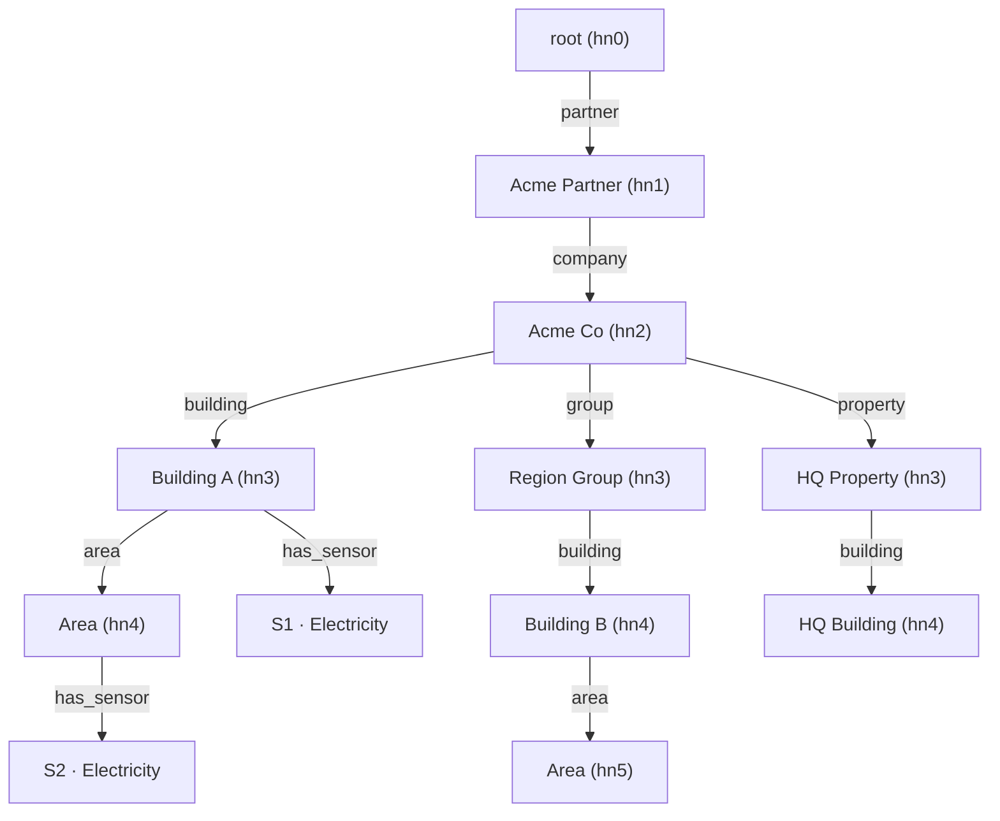
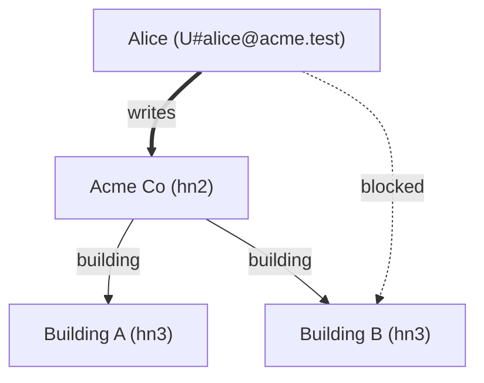
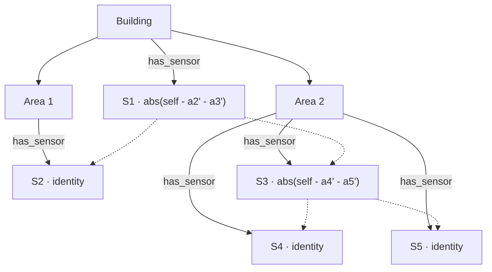

# Hierarchy and Sensors

Living reference for the node model, the per-company **type-graph schema (v2)**,
the sensor model, and the DynamoDB layout that backs them. Kept in sync with
`crates/model`.

See `docs/api.md` for the HTTP surface, `docs/architecture.md` for how these
domain concepts are layered.

---

## 1. Node model

A tree of typed nodes rooted at a singleton.

| Level | Role           | Notes                                                |
|-------|----------------|------------------------------------------------------|
| hn0   | root           | singleton, id = literal `HN0#root` (`NodeId::root`)  |
| hn1   | partner        | reserved type `"partner"`; outside the schema        |
| hn2   | company        | reserved type `"company"`; **owns a schema**         |
| hn3…9 | schema-defined | the node's **type** is declared by the owning schema |

Every node carries:

- `id` — `HN<n>#<int>` (integer from a per-level counter; root is `HN0#root`)
- `level` — **derived from `id`** (= the node's depth; not stored separately)
- `label` — the node's **type name** (the schema edge that created it; e.g.
  `"building"`). `"partner"` for hn1, `"company"` for hn2.
- `name` — human label
- `parent` — parent node id (root has `None`)
- `path` — pipe-separated ancestry incl. self (`HN0#root|HN1#…|HN2#…|…`)
- `created` — RFC 3339
- `metadata` — free-form JSON, validated against the schema for the node's type
- `schema` — only present on hn2

**A node's level is exactly its depth.** A child is always created at
`parent.level + 1` — there are **no cross-level skips**. What varies is the
node's *type*, not its level: the same type (e.g. `building`) can legitimately
appear at different depths in different branches (directly under `company` → hn3,
or under a `group` → hn4). The hierarchy is a tree of levels; the *schema* is a
separate DAG of types (§2).

**Ids are unique per level, not globally.** Each level has its own monotonic
counter (`count#HN<n>`, §6.2), so the integer in `HN<n>#<int>` is unique only
within that level — identity is the `(level, int)` pair. The same integer
appears at several levels; a path like
`HN0#root|HN1#10001|HN2#10003|HN3#10004|HN4#10001` is valid.

---

## 2. Per-company schema — a type graph (v2)

The schema lives on the hn2 node and governs *that* company's subtree only.
Sibling companies can have completely different shapes. **Levels are not a
schema concept** — the schema describes which *types* may contain which other
types, as a directed acyclic graph rooted at the reserved type `"company"`.

```rust
// crates/model/src/domain/schema.rs
pub struct EdgeSpec {            // cardinality of a parent-type → child-type edge
    pub min: Option<i32>,
    pub max: Option<i32>,
}

pub struct Schema {
    pub version:  u32,
    /// parent type → (child type → cardinality)
    pub edges:    Vec<(String, Vec<(String, EdgeSpec)>)>,
    /// type → (field name → field spec)
    pub metadata: Vec<(String, Vec<(String, FieldSpec)>)>,
    /// types at which sensors may attach
    pub sensors:  Vec<String>,
}

pub const COMPANY_TYPE: &str = "company"; // root of the type graph (the hn2 node)
pub const PARTNER_TYPE: &str = "partner"; // hn1, outside the schema (reserved)
```

### 2.1 Edges

Each `(parent_type, [(child_type, spec)])` entry declares which types may be
created directly under a given type. **The child type IS the label** — v1's
separate `label` string is gone. `company` may declare several children (e.g.
`group`, `property`, `building`); each of those declares its own children. The
same child type may appear under multiple parents (e.g. `building` under both
`company` and `group`), which is exactly what lets a `building` live at variable
depth.

`min` / `max` express cardinality per parent. Only `max` is enforced at write
time; `min` is informational.

### 2.2 Type resolution at `add_node`

The child **level** is always `parent.level + 1` (derived). The child **type**
is resolved from the parent type's allowed children:

- **hn0 → hn1** and **hn1 → hn2** are fixed: types `partner` then `company`.
- **schema-gated** (hn2 and below): from `schema.allowed_children(parent_type)`,
  - an explicit `label` must name an allowed child type;
  - an omitted `label` is accepted only when the parent type has **exactly one**
    allowed child type; otherwise the call errors ("specify label").

### 2.3 Metadata specs

`metadata` maps each **type** to its required/optional JSON fields. Supported
`FieldType` (`crates/model/src/domain/values.rs`):

| type        | constraints honoured                         |
|-------------|----------------------------------------------|
| `string`    | `min_len`, `max_len`                         |
| `number`    | `min`, `max` (float; accepts JSON ints too)  |
| `integer`   | `min`, `max` (i64)                           |
| `boolean`   | —                                            |
| `timestamp` | must parse as RFC 3339                       |
| `enum`      | `one_of` (non-empty list of allowed strings) |

Each field carries `required`. Unknown fields are ignored, not rejected.

### 2.4 Sensors list

`sensors: Vec<String>` names the **types** that may host sensors.

### 2.5 Schema self-validation (`Schema::validate`)

Run when an hn2 company is created. Enforces:

1. names non-empty; `"partner"` appears nowhere; `"company"` is never a child;
   no self-edges; no duplicate child under one parent; `min ≤ max`.
2. the type graph is a **DAG** (3-colour DFS rejects cycles).
3. every referenced type (edge parents, metadata, sensors) is **reachable from
   `"company"`**.
4. the **longest path from `"company"` is ≤ 7 edges** (so the deepest node fits
   hn9).
5. metadata field specs valid (e.g. non-empty `enum`); no duplicate `sensors`.

### 2.6 Schema resolution for a subtree (`schema_check::find_for`)

`find_for(id)` returns `(hn2_id, schema)`: an hn2 node returns its own schema; a
deeper node parses the HN2 segment out of its `path` and returns that node's
schema. Root or a node with no HN2 ancestor → `SchemaMissing`.

---

## 3. Example: one company, building at variable depth



`Acme Co`'s schema:

```
company → { group, property, building }
group   → { building }
property→ { building }
building→ { area }
```

`building` is reachable under `company` (→ hn3) *and* under `group`/`property`
(→ hn4); both buildings only allow `area` children, which therefore land at hn4
or hn5 respectively. Behaviours that fall out of the rules (all unit-tested in
`logic/hierarchy.rs`):

1. A `charger`/`plug` type the schema doesn't declare is rejected with
   `Validation`.
2. `group` under a `building` is rejected (`building`'s only child is `area`).
3. Omitting the label under `company` errors ("specify label", 3 child types);
   omitting it under `building` resolves to `area` (its sole child type).

### 3.1 Users in the graph

Users are not tree nodes; they attach via DynamoDB edges. A user row lives at
`pk = sk = U#<email>`; access and block edges point from that row into the
hierarchy:



The thick `writes` edge **grants** Alice a capability on Acme Co and its
subtree; the dashed `blocked` edge **revokes** it on Building B and below. Both
follow the single-table edge shape — `pk = U#<email>`, node id on the `sk` side:

- grant: `sk = writes#HN2#102`
- block: `sk = blocked#HN3#10044`

`EdgeKind = HasLabel | HasSensor | Blocked | Administrates | Reads | Writes`.
Access edges (`Administrates`/`Writes`/`Reads`, kind chosen from the user's
group) confer Admin/Writer/Reader down the subtree; `effective_permission`
returns the nearest one, nulled by any block on the chain. See
`docs/architecture.md` §9 for the full algorithm and row layout.

---

## 4. Rules

| Rule                                              | Enforced by                            |
|---------------------------------------------------|----------------------------------------|
| Child level = parent level + 1 (no skips)         | `hierarchy::add_node`                  |
| Child type is allowed under the parent type       | `Schema::allowed_children` / `edge_between` |
| Type unambiguous when label omitted               | `add_under_schema`                     |
| Metadata matches the type's field spec            | `schema::validate`                     |
| `max` cardinality per parent                      | `add_under_schema`                     |
| Schema self-consistency (DAG, reachable, depth ≤7)| `Schema::validate`                     |
| Sensors only on allowed types                     | `Schema::allows_sensors` via `sensors::attach` |

---

## 5. Sensors

### 5.1 Sensor record

```rust
// crates/model/src/domain/sensor.rs
pub enum MeterType { Counter, Gauge }

pub struct Sensor {
    pub id:         SensorId,   // logical identity, stable across device swaps
    pub created:    DateTime<Utc>, // when the current device became active
    pub daq_id:     String,     // physical data-acquisition id
    pub path:       String,     // pipe-separated ancestry incl. self (gsi1sk)
    pub purpose:    String,     // "Electricity", "Heat", …
    pub meter_type: MeterType,
    pub unit:       Option<String>,
    pub formula:    Formula,
    pub resample_minutes: Option<i32>, // > 0; None = no resampling
}
```

`SensorId` is `S#<int>`. The logical identity is the integer id; physical
devices change over time, tracked by promotion/demotion rows. The parent node is
recovered from `path`, not a stored field.

### 5.2 DynamoDB layout

One partition per sensor (`pk = S#<int>`). The active row uses a prefixed `sk`
so it is distinguishable from history without a filter.

| Attribute     | Active row                 | History row         |
|---------------|----------------------------|---------------------|
| `pk`          | `S#<int>`                  | `S#<int>`           |
| `sk`          | `active#<RFC3339 created>` | `<RFC3339 created>` |
| `gsi1pk`      | `S`                        | `S`                 |
| `gsi1sk`      | sensor `path`              | sensor `path`       |
| `daq_id`      | current device             | frozen historical   |
| `purpose`, `meter_type`, `unit`, `formula`, `resample_minutes` | current | snapshot at demotion |

`resample_minutes` and `unit` are only written when set. The `has_sensor` edge
row lives in the parent node's partition, written once at attach and surviving
device swaps:

| Attribute | Value                |
|-----------|----------------------|
| `pk`      | `<parent_pk>`        |
| `sk`      | `has_sensor#S#<int>` |
| `gsi1pk`  | `S`                  |
| `gsi1sk`  | sensor `path`        |

Listing sensors for a node is `Query pk=<parent>, sk begins_with has_sensor#`,
then one `Query pk=S#<int>, sk begins_with active#` per sensor.

### 5.3 Attach — atomic

`sensors::attach` allocates the sensor's int id from the `count#S` counter and
writes three rows in a single `TransactWriteItems`: the active sensor row, the
`has_sensor` edge row, and the counter bump (conditional → concurrent attaches
retry). A formula may be supplied (default `Identity`).

`Identity` (`S' = Self`), `Zero` (`S' = 0`), and `Expr` are the three variants.
`Expr` is a text expression over `self`, numeric literals, `+ - * /`, `abs()`,
parentheses, and named aliases; each alias is bound to another sensor id via a
`refs` map and resolves to that sensor's computed value `S'`. Aliases are scoped
to the owning HN2 company; cross-company references and formulas that introduce
a cycle in the reference graph are rejected.

### 5.4 Replace device — atomic

A sensor's `sk` includes its `created` timestamp, so in-place updates are
impossible. `sensors::replace_device` issues a three-op transaction:

1. **Delete** `{pk: S#<int>, sk: active#<old-created>}`
2. **Put** `{pk: S#<int>, sk: <old-created>, …}` — demote old device to history
3. **Put** `{pk: S#<int>, sk: active#<now>, daq_id: <new>, …}` — new active row

History rows form a timeline; each plain-timestamp row records when that device
*was* active from, up to the next replacement.

### 5.5 Delete

`delete_sensor` removes the whole sensor partition and the parent's
`has_sensor` edge. No soft-delete.

### 5.6 Formulas

Every sensor produces a computed value `S'` that is always non-negative.

```rust
// crates/model/src/domain/formula.rs
pub enum Formula {
    Identity,                 // S' = Self (default)
    Zero,                     // S' = 0   (exclude from aggregations)
    Expr { refs: Vec<(String, SensorId)>, expr: Expr }, // alias -> sensor id
}

pub enum Expr {
    Num(f64),
    SelfRef,                  // raw meter reading (named SelfRef; `Self` is reserved)
    Ref(String),             // computed value S' of a referenced sensor
    Abs(Box<Expr>),
    Add(Box<Expr>, Box<Expr>), Sub(Box<Expr>, Box<Expr>),
    Mul(Box<Expr>, Box<Expr>), Div(Box<Expr>, Box<Expr>),
}
```

- **`Identity`** — `S' = Self`, the common case.
- **`Zero`** — `S' = 0`. Keeps the row and edges but contributes nothing to
  aggregations (duplicate coverage, drifted meter, billing-separated
  consumption, …). Evaluation short-circuits before reading, so it is correct
  even with no reading available.
- **`Expr`** — composite. `Self` is *this* meter's raw reading; `Ref alias`
  resolves (via `refs`) to the *computed* value `S'` of another sensor.
  Evaluation is topological — leaves before the sensors that reference them.

Composite formulas typically subtract sub-metered contributions so that summing
every sensor's `S'` in a subtree gives total consumption with no
double-counting.

#### Worked example — nested sub-metering



Solid edges are hierarchy; dashed edges are formula references — `Ref` resolves
to the referenced sensor's *computed* `S'`, not its raw reading.

- `S2' = Self`; `S4' = Self`, `S5' = Self` — raw sub-meter readings.
- `S3' = abs(Self - S4' - S5')` — area 2 *remainder* after its sub-meters.
- `S1' = abs(Self - S2' - S3')` — building remainder after the two areas.

Total building consumption = `S1' + S2' + S3' + S4' + S5'`. Each sensor
contributes its net share; nothing is counted twice. The non-obvious part:
`Ref` to a non-identity sensor resolves to *its* output, so coverage meters can
stack without per-level knowledge of the referenced sensor's own formula.

Cycles are rejected at attach time and on `set_formula`. Evaluation
(`sensors::evaluate`) walks the formula DAG, reading each leaf; the reading hook
is a stub today (returns `None`), so wiring a real time-series source is future
work.

---

## 6. DynamoDB layout (single table)

Table name in `$ITEST_DYNAMO_TABLE` (prod: `hierarchy_new`).

### 6.1 Hierarchy & edges

| Attribute | Node row              | User-side edge row (access / block)           |
|-----------|-----------------------|-----------------------------------------------|
| `pk`      | `HN<n>#<int>` (= `sk`)| `<from_pk>` (`U#<email>` for user edges)      |
| `sk`      | `HN<n>#<int>` (= `pk`)| `<sk_verb>#<to_pk>`                            |
| `type`    | `node`                | `edge`                                         |
| `kind`    | —                     | `EdgeKind::kind_string` (e.g. `writes`, `has_label:building`) |
| `name`    | human label           | **stored on edge** (id+name listing, no GetItem) |
| `created` | RFC 3339              | RFC 3339                                       |
| `metadata`| JSON map              | —                                             |
| `schema`  | hn2 only              | —                                             |
| `gsi1pk`  | `HN<n>` (level anchor)| `<to_pk>`                                      |
| `gsi1sk`  | node `path`           | `<gsi_verb>#<from_pk>`                         |

`sk_verb` per kind: `has_<label>`, `has_sensor`, `blocked`, `administrates`,
`reads`, `writes`. **HN-side** edges (`HasLabel`, `HasSensor`) have **no**
`gsi_verb` — their `gsi1pk` is the child's level anchor / `S` and `gsi1sk` is the
child/sensor `path` (direction carried structurally). **User-side** edges carry
a reverse verb on `gsi1sk`: `blocks`, `administrators`, `readers`, `writers`.

#### Worked example — a writes edge

`grant_access { user_id="U#alice@acme.test", node_id="HN3#10044", kind=Writes }`:

| Attribute | Value                       | Source                       |
|-----------|-----------------------------|------------------------------|
| `pk`      | `U#alice@acme.test`         | `from_`                      |
| `sk`      | `writes#HN3#10044`          | `sk_verb(Writes)`            |
| `type`    | `edge`                      | constant                     |
| `kind`    | `writes`                    | `kind_string(Writes)`        |
| `gsi1pk`  | `HN3#10044`                 | `to_`                        |
| `gsi1sk`  | `writers#U#alice@acme.test` | `gsi_verb(Writes)`           |

"Nodes Alice can write" is `Query pk=U#alice@acme.test, sk begins_with writes#`.
"Users who can write HN3#10044" is the mirror on GSI1:
`Query gsi1pk=HN3#10044, gsi1sk begins_with writers#`.

### 6.2 Counters

One counter row per level (and one for sensors) backs the monotonic id
allocator. `add_node` / `attach_sensor` read-and-bump the matching row inside
the same `TransactWriteItems` that writes the vertex, with a
`ConditionExpression` so concurrent adds retry rather than collide.

| Attribute | Value                                              |
|-----------|----------------------------------------------------|
| `pk`      | `count#HN<n>` (per level) or `count#S` (sensors)   |
| `sk`      | `count`                                            |
| `type`    | `counter`                                          |
| `n`       | next-id allocator (monotonic)                      |
| `live`    | current cardinality (decremented on delete)        |

### 6.3 Sensors — see §5.2.

### 6.4 Query patterns

| Use case                                  | Query                                                                    |
|-------------------------------------------|--------------------------------------------------------------------------|
| Exact node by id                          | `GetItem pk=id, sk=id`                                                    |
| Direct child refs (id+name only)          | `Query pk=parent, sk begins_with has_` — no extra GetItem                |
| Direct children (full nodes)              | `Query pk=parent, sk begins_with has_`, then `GetItem` per child         |
| Children of a specific type               | `Query pk=parent, sk begins_with has_<type>#`                            |
| Reverse lookup — who points at Y          | `Query gsi1pk=Y`                                                         |
| Active sensors on a node                  | `Query pk=parent, sk begins_with has_sensor#` → ids, then one Query each |
| Full history for a sensor                 | `Query pk=S#<int>` — active + history, sorted by `sk`                    |
| Nodes a user is blocked from              | `Query pk=U#<email>, sk begins_with blocked#`                            |
| Users blocked from a node                 | `Query gsi1pk=<node_id>, gsi1sk begins_with blocks#` (GSI1)              |
| Nodes a user can write                    | `Query pk=U#<email>, sk begins_with writes#`                            |

`list_children`'s default (edge-row) mode avoids the N+1 fan-out for dense
subtrees; `?full=true` opts in when node metadata is needed.

### 6.5 Cascade delete

`delete_node` walks the subtree via edge rows and removes every node and edge;
sensor partitions under deleted nodes are wiped too. Deleting a user or node
also removes the associated access/block edges (logic-layer, non-transactional)
— see `docs/architecture.md` §9.

---

## 7. File map

| File                                | Role                                                  |
|-------------------------------------|-------------------------------------------------------|
| `domain/ids.rs`                     | `Level` (hn0..hn9 + depth), `NodeId`, `SensorId`, `UserId` |
| `domain/node.rs`                    | node record + `make` / path helpers                   |
| `domain/schema.rs`                  | type-graph `Schema` (v2) + `validate` + metadata validation |
| `domain/values.rs`                  | `EdgeKind`, `CognitoGroup`, `Profile`, `FieldType`, `MeterType`, … |
| `domain/sensor.rs`, `sensor_sk.rs`  | sensor record + `active#`/plain-ts sort-key codec     |
| `domain/formula.rs`                 | formula AST + eval                                    |
| `domain/user.rs`                    | user record                                           |
| `errors.rs`                         | `RepositoryError`                                     |
| `logic/hierarchy.rs`                | `add_node`, `list_children`, `list_child_refs`, `get_node` |
| `logic/schema_check.rs`             | `find_for` — walk up to the HN2 schema                |
| `logic/sensors.rs`                  | `attach`, `list_active`, `replace_device`, `set_formula`, `evaluate` |
| `logic/users.rs`                    | `create`, `get`, `update`, `delete`, `list`           |
| `logic/access.rs`                   | block/unblock, grant_access/administrates, effective_permission, has_access, start_nodes |
| `repository/dynamodb/*`             | node/edge/sensor/user closures + codec (AWS SDK)      |
| `repository/cognito/*`              | Cognito user provisioning / deletion                  |
| `repository/memory.rs`              | in-memory `Store` for unit tests                      |
