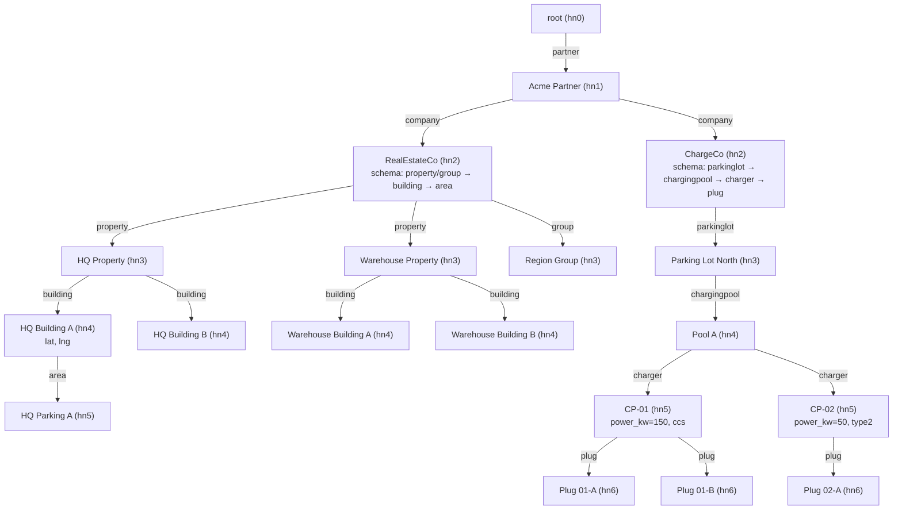

# Hierarchy and Sensors Design

**Status:** current hierarchy implemented; sensors are the next-step extension.
**Scope:** documents the node model, per-company schema, DynamoDB layout, and how sensors with formulas will be added.

---

## 1. Node model

A tree of typed nodes, rooted at a global singleton.

| Level | Role              | Notes                                       |
|-------|-------------------|---------------------------------------------|
| hn0   | root              | singleton, id = `ROOT#root`                 |
| hn1   | partner           | business tenant (e.g. "Acme Partner")       |
| hn2   | company           | **owns a schema** that shapes everything below |
| hn3+  | schema-defined    | meaning is whatever the hn2 schema declares |

Every node has:

- `id` — `<LEVEL>#<uuid>` (or `ROOT#root` for the root)
- `level` — hn0..hn9
- `name` — human label
- `parent` — parent node id (root has no parent)
- `created` — RFC 3339 timestamp
- `metadata` — free-form JSON, validated against the schema for this level
- `schema` — only present on hn2 (the company)

Depth must strictly increase from parent to child: an hn3 cannot live under another hn3. Cross-branch shortcuts (e.g. hn2 → hn4 skipping hn3) are allowed **if** the schema declares that edge.

---

## 2. Per-company schema

The schema lives on the hn2 node and governs *that* company's subtree only. Sibling companies can have completely different shapes.

```ocaml
type edge_spec = { label : string; min : int option; max : int option }

type t = {
  version  : int;
  edges    : (Level.t * (Level.t * edge_spec list) list) list;
  metadata : (Level.t * (string * Metadata.field_spec) list) list;
}
```

### 2.1 Edges

Each `(parent_level, [(child_level, specs)])` entry declares one or more labeled edges between two levels. `specs` is a **list** so a single `(parent, child)` level pair can host several semantically distinct relationships — e.g. at hn2→hn3 a company may declare both `property` and `group`.

`min` / `max` express cardinality per parent. Only `max` is enforced at add time; `min` is informational (a future "finalize" check).

When multiple labels exist between two levels, callers must disambiguate via `~label`:

```ocaml
Hierarchy.add_node ~label:"property" ~parent:company_id ~level:Hn3 ...
```

### 2.2 Metadata specs

`metadata` maps each level to the required/optional JSON fields for nodes at that level. Supported types today:

- `Number { min; max }` — bounded floats
- `Enum { one_of }` — string whitelist
- `String` — opaque
- (extend here as needed)

### 2.3 Schema resolution

`Schema_check.find_for id` walks up from `id` until it hits an hn2 with a schema. The hn2's schema is authoritative for the whole subtree rooted at that company. Orphan nodes (no hn2 ancestor) get `Schema_missing`.

---

## 3. Example: two companies, two shapes

Both companies hang off the same partner, but declare different schemas:



Two invariants to notice:

1. **RealEstateCo has no `charger` or `plug`** — its schema does not declare those labels, so `Hierarchy.add_node` rejects them with `Validation`.
2. **ChargeCo has no `property`** — same reason, the other direction. This is asserted as a negative test in `itest/test_dynamo.ml`.

---

## 4. DynamoDB layout

Single-table design, table name in `$ITEST_DYNAMO_TABLE` (prod: `hierarchy_new`).

| Attribute | Node row                      | Edge row                                |
|-----------|-------------------------------|-----------------------------------------|
| `pk`      | `<LEVEL>#<uuid>`              | `<parent_pk>`                           |
| `sk`      | `NODE#`                       | `has_<label>#<child_pk>`                |
| `gsi1pk`  | `<parent_pk>` (or `ROOT#root`)| — (edges don't need the inverted index) |
| `gsi1sk`  | `CHILD#<LEVEL>#<uuid>`        | —                                       |

`gsi1` is used for `list_children` — query `gsi1pk = parent_pk` returns every child in one round trip.

`delete_node` is cascading: walks the subtree via `list_children`, removes every edge and every node row.

---

## 5. Rules summary

| Rule | Where enforced |
|------|----------------|
| Parent depth < child depth | `Hierarchy.add_node` |
| Edge label is declared by the hn2 schema | `Hierarchy.add_node` via `Schema.edges_between` |
| When multiple labels are valid, caller must pass `~label` | `Hierarchy.add_node` |
| Metadata matches the level's field spec (types, bounds, required) | `Metadata.validate` |
| `max` cardinality per parent | `Hierarchy.add_node` |
| Schema self-consistency (depth order, unique labels per edge, valid metadata specs) | `Schema.validate` |

---

## 6. Sensors (next step) — extension design

Goal: attach physical meter readings to nodes. Schema decides which levels can host sensors; a sensor has its own identity independent from the node it is attached to, plus a formula that may reference other sensors.

### 6.1 Data shape

One sensor row per physical meter, same table:

| Attribute        | Example                                            | Purpose |
|------------------|----------------------------------------------------|---------|
| `pk`             | `09826`                                            | partner/customer id (tenant scope) |
| `sk`             | `daq:adeunis_pu_v1:123:0018b210000191c7:counter_a` | physical device address |
| `hierarchy_path` | `P1#C1#PR1#B2`                                     | short human path pointing at the owning node |
| `node_id`        | `HN4#<uuid>`                                       | canonical FK into the node table |
| `logical_id`     | `tjrM38B0S3agQ7+veTHJxg==`                         | opaque, stable sensor identity; used by formulas |
| `meter_type`     | `counter` \| `gauge`                               | semantic kind |
| `unit`           | `kWh`, `m3`, …                                     | optional, informational |
| `formula`        | (see §6.3)                                         | expression evaluated at read time |
| `updated_at`     | `2026-03-28T12:00:00Z`                             | last reading timestamp |

`hierarchy_path` is cached for readability / path-based queries; `node_id` is the source of truth.

### 6.2 Schema extension

Extend `Schema.t` with a third map, sibling to `edges` and `metadata`:

```ocaml
type sensor_slot = {
  kind     : string;            (* e.g. "electricity", "water" *)
  min      : int option;
  max      : int option;
  meter_type : [ `Counter | `Gauge | `Either ];
}

type t = {
  version  : int;
  edges    : (Level.t * (Level.t * edge_spec list) list) list;
  metadata : (Level.t * (string * Metadata.field_spec) list) list;
  sensors  : (Level.t * sensor_slot list) list;   (* NEW *)
}
```

Then `Hierarchy.attach_sensor ~parent ~kind ...` mirrors `add_node`:
- resolve schema via `Schema_check.find_for`
- look up `sensor_slot`s declared for the parent's level
- disambiguate by `~kind` when multiple slots exist
- enforce `max` the same way cardinality is enforced for edges

Levels with no entry in `sensors` simply cannot host meters, and attachment fails with `Validation`.

### 6.3 Formula model

Default is identity — "what the meter reports" — which must be representable without the user writing anything. Anything else is an expression referencing this sensor and/or others by local alias.

```ocaml
type formula =
  | Identity                        (* = 1 * value, the common case *)
  | Expr of {
      ast  : expr;
      refs : (string * Logical_id.t) list;   (* S1 -> <logical_id>, ... *)
    }

and expr =
  | Num  of float
  | Self                            (* this meter's value *)
  | Ref  of string                  (* name from refs, e.g. "S1" *)
  | Neg  of expr
  | Add  of expr * expr
  | Sub  of expr * expr
  | Mul  of expr * expr
  | Div  of expr * expr
```

Examples:
- `1 * value`  → `Identity`
- `S1 - S2`    → `Expr { ast = Sub (Ref "S1", Ref "S2"); refs = [("S1", id_a); ("S2", id_b)] }`
- `S1 * 1 - S2 * 1` → same as above (multiplier elided; parser folds `Mul (_, Num 1.0)`)

`refs` deliberately decouples formula text from `logical_id`s, so sensors can be renamed/re-keyed without rewriting every formula that mentions them. Evaluation walks `refs`, fetches each referenced sensor's latest reading, substitutes, and reduces.

### 6.4 How this stays additive

- The existing `edges` / `metadata` model is untouched; `sensors` is a new optional key on the schema record.
- Node rows don't change shape. Sensors are a new row type identified by `sk` prefix (`SENSOR#...` or the `daq:` convention above).
- `Schema_check.find_for` already gives any node its owning schema — sensor attachment reuses it unchanged.
- Formula evaluation is pure and lives in a new `Formula` module; it has no side effects beyond the `Effects.get_sensor_value` it will introduce.

---

## 7. File map

| File                          | Role                                        |
|-------------------------------|---------------------------------------------|
| `lib/domain/level.ml`         | hn0..hn9 enum + depth                       |
| `lib/domain/node_id.ml`       | `<LEVEL>#<uuid>` parser                     |
| `lib/domain/node.ml`          | node record                                 |
| `lib/domain/schema.ml`        | schema type + `validate` + `edges_between`  |
| `lib/domain/metadata.ml`      | field spec + validation                     |
| `lib/logic/hierarchy.ml`      | `add_node`, `list_children`, `delete_node`  |
| `lib/logic/schema_check.ml`   | `find_for` — walk up to the hn2 schema      |
| `lib/repo/codec.ml`           | node ↔ DynamoDB attribute map               |
| `lib/repo/dynamo.ml`          | Eio-based effect handler over smaws         |
| `lib/repo/memory.ml`          | in-memory handler for unit tests            |
| `itest/test_dynamo.ml`        | real-table integration test (this doc's example) |
