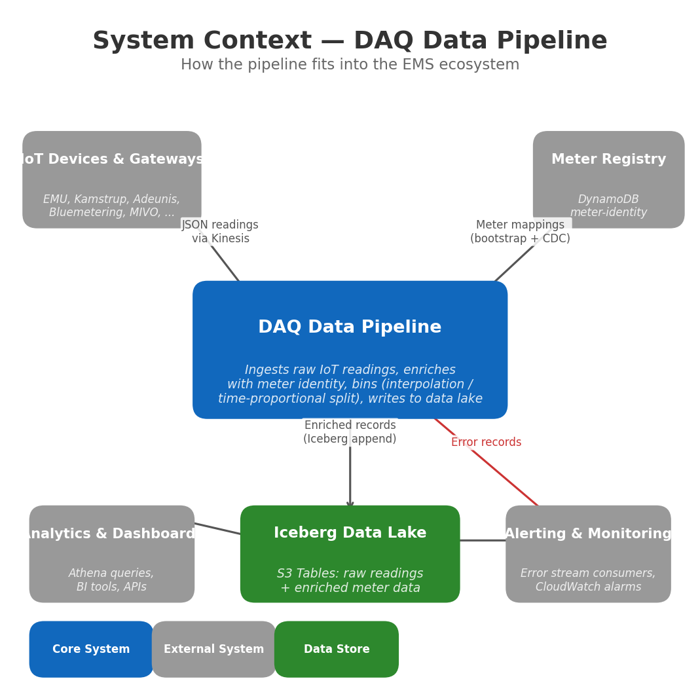
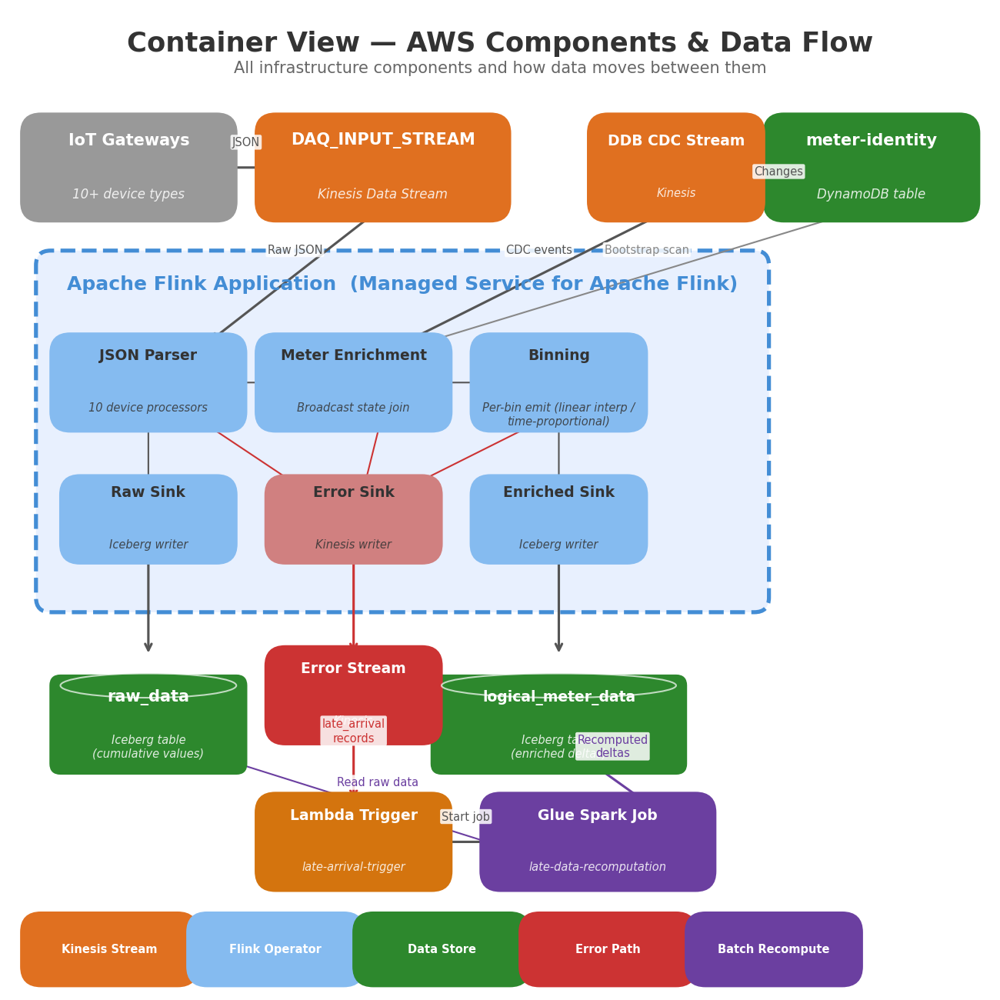
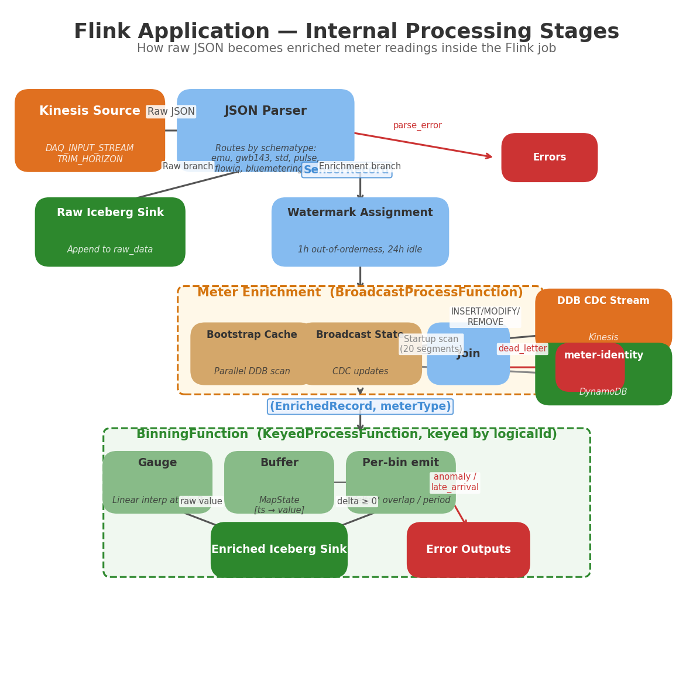
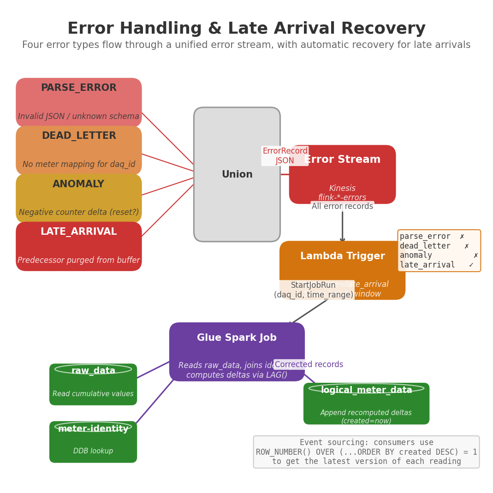

# DAQ Data Pipeline

Real-time IoT data ingestion pipeline that transforms raw device readings into enriched, queryable meter data. Built on Apache Flink (Managed Service for Apache Flink), Apache Iceberg (S3 Tables), and AWS serverless components.

---

## System Context



The pipeline sits between IoT device gateways and the Iceberg data lake. It receives raw JSON readings from 10+ device types via Kinesis, enriches them with meter identity from DynamoDB, computes counter deltas, and writes the results to two Iceberg tables. A separate batch path handles records that arrive too late for the streaming buffer.

**Inputs:**
- `DAQ_INPUT_STREAM` — Kinesis stream carrying raw device readings in JSON format
- `meter-identity` — DynamoDB table mapping physical device IDs to logical meter UUIDs, meter types, and hierarchy positions

**Outputs:**
- `raw_data` — Iceberg table with raw cumulative readings (audit trail)
- `logical_meter_data` — Iceberg table with enriched readings (deltas for counters, raw for gauges), with hierarchy context
- Error stream — Kinesis stream carrying parse errors, dead letters, anomalies, and late arrivals

---

## Container View



### AWS Components

| Component | Service | Purpose |
|-----------|---------|---------|
| `DAQ_INPUT_STREAM` | Kinesis Data Stream | Ingestion point for all device readings |
| `flink-iceberg-processor` | Managed Flink (1.20) | Stream processing: parse, enrich, compute deltas, write Iceberg |
| `flink-iceberg-processor-ddb-changes` | Kinesis Data Stream | CDC feed from meter-identity DynamoDB table |
| `flink-iceberg-processor-errors` | Kinesis Data Stream | Unified error stream (4 error types) |
| `meter-identity` | DynamoDB | Maps physical daq_id to logical logical_id, type, hierarchy |
| `raw_data` | Iceberg on S3 Tables | Raw cumulative readings |
| `logical_meter_data` | Iceberg on S3 Tables | Enriched meter readings with computed deltas |
| `late-arrival-trigger` | Lambda (Python 3.12) | Filters error stream for late arrivals, triggers Glue |
| `late-data-recomputation` | Glue Spark 4.0 | Batch recomputation of counter deltas from raw data |

### Data Flow Summary

1. IoT gateways push JSON readings to `DAQ_INPUT_STREAM`
2. Flink parses, writes raw data to `raw_data`, and forks to the enrichment path
3. Enrichment joins with meter identity (broadcast state), then counter delta is computed
4. Enriched records are written to `logical_meter_data`
5. Errors flow to the error Kinesis stream; late arrivals trigger batch recomputation via Lambda + Glue

---

## Flink Application Internals



The Flink app is written in Scala 3 and runs on Flink 1.20. It has 7 processing stages, organized into two branches after parsing.

### Stage 1: JSON Parsing

**File:** `flink_app_scala/src/main/scala/com/enity/flink/Main.scala`

A `ProcessFunction` receives raw JSON strings from Kinesis and routes them by `schematype` to device-specific processors:

| Schema Type | Processor | Devices |
|-------------|-----------|---------|
| `emu_profes_v1` | EmuProcessor | EMU Professional energy meters |
| `gwb143_json_v1` | Gwb143Processor | GWB143 gateway aggregators |
| `std_json_v1` / `std_jsonl_v1` | StdProcessor | Generic JSON/JSONL format |
| `pulse_v1` / `adeunis_pu_v1` | PulseProcessor | Adeunis pulse counters (LoRaWAN) |
| `flowiq2200_v1` | Flowiq2200Processor | Kamstrup FLOWIQ water meters |
| `bluemetering_json_v1` | BluemeteringProcessor | Bluemetering smart meters |
| `mivo_json_v1` | MivoProcessor | MIVO multi-meter aggregators |
| `mc603_v1` | Mc603Processor | Kamstrup MC603 heat meters |
| `ediel_json_v1` | EdielProcessor | EDIEL energy data format |

Each processor normalizes its input into a `SensorRecord` with a unique `daq_id` of the form `{schematype}:{customerid}:{deviceid}:{sensorid}`.

Invalid records are sent to the `PARSE_ERROR` side output.

### Stage 2: Raw Iceberg Sink (raw branch)

Every `SensorRecord` is written to `raw_data` as-is. This preserves the original cumulative values for audit and recomputation.

**Schema:** `daq_id, timestamp, value, unit, created`

### Stage 3: Watermark Assignment (enrichment branch)

Event-time watermarks are assigned with:
- **Out-of-orderness:** 1 hour (configurable via `MAX_OUT_OF_ORDERNESS_MS`)
- **Idleness timeout:** 24 hours — prevents idle Kinesis shards from blocking the global watermark

### Stage 4: Meter Enrichment

**File:** `flink_app_scala/src/main/scala/com/enity/flink/enrichment/MeterEnrichmentFunction.scala`

A `BroadcastProcessFunction` joins each `SensorRecord` with meter identity data:

- **Bootstrap (startup):** Parallel DynamoDB scan with 20 segments loads all mappings into a local cache (~30-60s for millions of meters). See `DdbBootstrapLoader.scala`.
- **CDC (runtime):** DynamoDB Streams events flow through the `flink-*-ddb-changes` Kinesis stream, deserialized by `DdbStreamDeserializer.scala`, and update broadcast state in real time.
- **Lookup priority:** Broadcast state first, then bootstrap cache fallback.

If no mapping is found for a `daq_id`, the record goes to the `DEAD_LETTER` side output.

**Output:** `(EnrichedRecord, meterType)` tuples, where `meterType` is `"gauge"` or `"counter"`.

### Stage 5: Counter Delta Computation

**File:** `flink_app_scala/src/main/scala/com/enity/flink/enrichment/CounterDeltaFunction.scala`

A `KeyedProcessFunction` keyed by `logicalId` handles two meter types differently:

**Gauge meters** pass through with the raw value unchanged.

**Counter meters** require delta computation (current - previous cumulative value):

- Each record is buffered in `MapState[timestamp -> BufferedReading]`
- A delta is computed immediately against the predecessor in the sorted buffer
- Event-time timers are registered for out-of-order handling: if an earlier record arrives later, `onTimer` recomputes affected deltas
- `lastEmittedTs` tracking prevents double emission
- Buffer entries older than 6 hours (configurable via `BUFFER_RETENTION_MS`) are purged

**Side outputs:**
- `ANOMALY` — negative delta (counter reset or data error)
- `LATE_ARRIVAL` — no predecessor in buffer (purged); triggers batch recomputation

### Stage 6: Enriched Iceberg Sink

Enriched records are written to `logical_meter_data` with full hierarchy context.

**Schema:** `logical_id, timestamp, value, unit, created, partner_id, company_id, property_id, building_id, area_id, group_id`

### Stage 7: Error Stream Sink

Four error side outputs are unioned and written to the error Kinesis stream:

```
PARSE_ERROR  +  DEAD_LETTER  +  ANOMALY  +  LATE_ARRIVAL  ->  Error Stream
```

Each error record contains: `type`, `timestamp`, `daq_id`, `payload` (first 1000 chars), `error` message.

---

## Error Handling & Late Arrival Recovery



### Error Types

| Type | Source | Cause | Action |
|------|--------|-------|--------|
| `parse_error` | JSON Parser | Invalid JSON, unknown schema, processor exception | Log and investigate device |
| `dead_letter` | Meter Enrichment | No mapping in meter-identity for this daq_id | Register the meter, then data will flow on next occurrence |
| `anomaly` | Counter Delta | Negative delta (counter reset/replacement) | Manual review — record is not written to enriched table |
| `late_arrival` | Counter Delta | Predecessor purged from buffer (>6h late) | Automatic: Lambda triggers Glue batch recomputation |

### Late Arrival Recovery Pipeline

When a counter record arrives so late that its predecessor has been purged from the Flink buffer:

1. **Flink** detects the missing predecessor and emits a `late_arrival` error record to the error stream
2. **Lambda** (`late-arrival-trigger`) consumes the error stream with a 5-minute batch window, filters for `type=late_arrival`, groups by `daq_id`, and starts a Glue job
3. **Glue** (`late-data-recomputation`) reads the raw cumulative data from `raw_data`, joins with meter identity, and recomputes counter deltas using a SQL `LAG()` window function
4. Corrected records are appended to `logical_meter_data` with `created=now()`

**Lambda:** `lambda/late_arrival_trigger/handler.py`
**Glue script:** `glue/late_recomputation.py`

### Event Sourcing

The enriched table uses **append-only event sourcing**. Multiple records can exist for the same `(logical_id, timestamp)` pair, differentiated by `created`. Downstream consumers use:

```sql
SELECT * FROM (
    SELECT *, ROW_NUMBER() OVER (
        PARTITION BY logical_id, timestamp
        ORDER BY created DESC
    ) AS rn
    FROM logical_meter_data
)
WHERE rn = 1
```

This ensures recomputed records transparently supersede earlier versions.

---

## Meter Identity

The `meter-identity` DynamoDB table maps physical device identifiers to logical meters:

| Field | Type | Description |
|-------|------|-------------|
| `pk` | String | Partition key: zero-padded hash bucket (5 digits) |
| `sk` | String | Sort key: the `daq_id` (physical device identifier) |
| `logical_id` | Binary | 16-byte UUID (binary encoding, not string) |
| `meter_type` | String | `"gauge"` or `"counter"` |
| `hierarchy_path` | String | e.g. `P1#C2#PR4#B8#A1` |

**Partition key (`pk`) derivation:** Uses Java's `String.hashCode()` algorithm on the `daq_id`, then `abs(hashCode) % 20_000`, zero-padded to 5 digits. This distributes ~100 items per DynamoDB partition page, keeping each `Query` to ~1 RCU.

```
pk = str(abs(java_hashcode(daq_id)) % 20_000).zfill(5)
```

Java's `String.hashCode()` in Python:
```python
def java_hashcode(s: str) -> int:
    h = 0
    for c in s:
        h = ((31 * h) + ord(c)) & 0xFFFFFFFF
    return h - 0x100000000 if h >= 0x80000000 else h
```

**Logical ID (`logical_id`):** A random UUID v4 generated when a new meter is registered, stored as raw 16 bytes (binary), not as a string. To encode for DynamoDB: `base64(uuid.bytes)`.

**Hierarchy path format:** `P{partner}#C{company}#PR{property}#B{building}#A{area}#G{group}` — segments are optional beyond partner and company.

The table is consumed two ways:
- **Bootstrap scan** at Flink startup (20 parallel DynamoDB segments)
- **CDC stream** via DynamoDB Streams linked to a Kinesis stream, providing real-time broadcast state updates

---

## Infrastructure (CDK)

Two CDK stacks manage the infrastructure:

### DaqPipelineStack

**File:** `lib/data_pipeline_stack.ts`

- Kinesis input stream reference (`DAQ_INPUT_STREAM`)
- DynamoDB `meter-identity` table (with DynamoDB Streams linked to Kinesis CDC stream)
- Kinesis error stream
- Managed Flink application (KDA) with:
  - Flink 1.20 runtime
  - 5-minute checkpoint interval
  - Auto-scaling enabled
  - Snapshot-based restore (`RESTORE_FROM_LATEST_SNAPSHOT`)
- IAM roles for Kinesis, S3 Tables (Iceberg), DynamoDB, CloudWatch

### LateRecomputationStack

**File:** `lib/late-recomputation-stack.ts`

- S3 bucket for Glue scripts
- Glue ETL job (`late-data-recomputation`, Spark 4.0, Iceberg support)
- Lambda function (`late-arrival-trigger`, Python 3.12)
  - Event source: error Kinesis stream with 5-minute batch window
  - Starts Glue jobs for late arrivals
- IAM roles for S3 Tables, DynamoDB, Glue

**Dependency:** `LateRecomputationStack` depends on `DaqPipelineStack` (consumes `errorStream` and `meterIdentityTable`).

---

## Configuration

The Flink application reads configuration from KDA environment properties:

| Property | Default | Description |
|----------|---------|-------------|
| `INPUT_STREAM` | `DAQ_INPUT_STREAM` | Kinesis input stream name |
| `DDB_CHANGE_STREAM` | — | Kinesis stream for DDB CDC (enables enrichment) |
| `ERROR_STREAM` | — | Kinesis stream for error records |
| `METER_IDENTITY_TABLE` | `meter-identity` | DynamoDB table name |
| `TABLE_BUCKET_NAME` | `measurements` | S3 Tables bucket name |
| `MAX_OUT_OF_ORDERNESS_MS` | `3600000` | Watermark out-of-orderness (1 hour) |
| `BUFFER_RETENTION_MS` | `21600000` | Counter delta buffer retention (6 hours) |

---

## Development

### Build & Test (Flink App)

```bash
cd flink_app_scala

# Run tests
sbt test

# Build fat JAR for deployment
sbt assembly
# Output: target/scala-3.3.4/flink-app-scala-0.1.0.jar
```

### Deploy

```bash
# Deploy both stacks
npx cdk deploy DaqPipelineStack LateRecomputationStack

# Deploy Flink stack only (after JAR changes)
npx cdk deploy DaqPipelineStack
```

### Test Data

```bash
cd scripts

# Generate and send historical counter data (60 days, hourly)
uv run --with boto3 python3 generate_historical_counters.py --days 60 --dry-run
uv run --with boto3 python3 generate_historical_counters.py --days 60

# Verify ingestion (checks raw_data, enriched table, consistency)
uv run --with boto3 python3 verify_ingestion.py \
  --daq-id "daq:std_json_v1:countertest:test_counter_001:volume" \
  --logical-id "93ea16e6-fecc-42fa-ad56-ff3cc2b31f0c"
```

### Query Data (Athena)

```sql
-- Raw cumulative readings
SELECT * FROM "all"."raw_data"
WHERE daq_id = 'daq:std_json_v1:countertest:test_counter_001:volume'
ORDER BY timestamp;

-- Enriched readings (latest version per timestamp)
SELECT * FROM (
    SELECT *, ROW_NUMBER() OVER (
        PARTITION BY logical_id, timestamp ORDER BY created DESC
    ) AS rn
    FROM "all"."logical_meter_data"
    WHERE logical_id = '93ea16e6-fecc-42fa-ad56-ff3cc2b31f0c'
)
WHERE rn = 1
ORDER BY timestamp;
```

**Athena catalog:** `s3tablescatalog/measurements`, database `all`.

---

## Key Files

```
data_pipeline/
  bin/data_pipeline_stack.ts       # CDK app entry point
  lib/data_pipeline_stack.ts       # Flink + Kinesis + DDB stack
  lib/s3tables-stack.ts            # S3 Tables (Iceberg) table definitions
  lib/late-recomputation-stack.ts  # Lambda + Glue stack
  glue/late_recomputation.py       # Glue PySpark recomputation job
  lambda/late_arrival_trigger/     # Lambda trigger for late arrivals
  scripts/
    generate_historical_counters.py  # Test data generator
    verify_ingestion.py              # Ingestion verification tool
  docs/
    01-system-context.png            # C4 Level 1 diagram
    02-container-view.png            # C4 Level 2 diagram
    03-flink-internals.png           # C4 Level 3 diagram
    04-error-recovery-flow.png       # Error handling diagram
  flink_app_scala/
    src/main/scala/com/enity/flink/
      Main.scala                     # Flink job entry point & pipeline wiring
      Models.scala                   # SensorRecord definition
      processors/                    # Device-specific JSON parsers
      enrichment/
        MeterEnrichmentFunction.scala  # Broadcast state join
        CounterDeltaFunction.scala     # Counter delta computation
        DdbBootstrapLoader.scala       # Parallel DDB scan at startup
        DdbStreamDeserializer.scala    # CDC event parsing
        MeterMapping.scala             # Mapping data model
        HierarchyPathParser.scala      # P1#C2#B5 path parser
        SideOutputTags.scala           # Error type definitions
```
